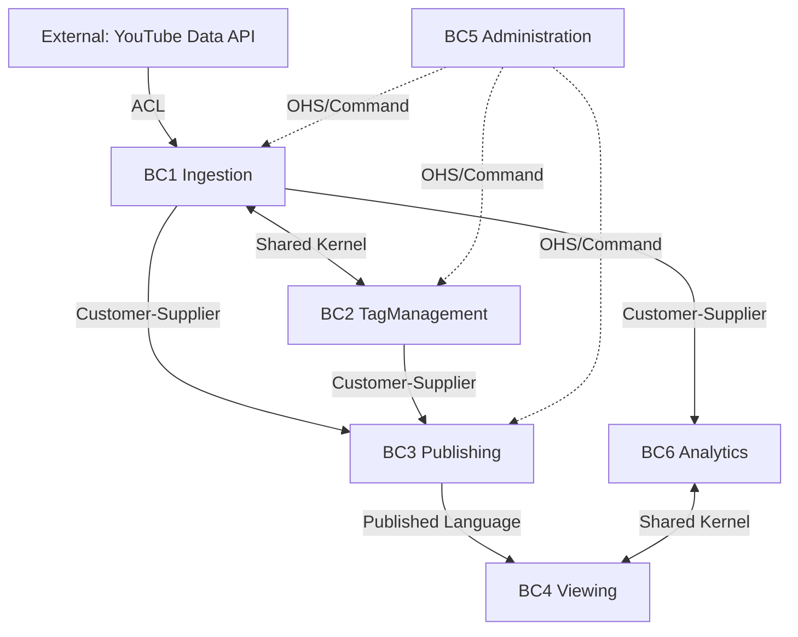

## 目的
- 5+1 BC の関係パターン（ACL / Customer-Supplier / Published Language / Shared Kernel / OHS）を明文化し、境界間契約の変更点を追跡可能にする。

## コンテキスト一覧
- BC1: Ingestion（[[DOM-BC-001]]）
- BC2: TagManagement（[[DOM-BC-002]]）
- BC3: Publishing（[[DOM-BC-003]]）
- BC4: Viewing（[[DOM-BC-004]]）
- BC5: Administration（[[DOM-BC-005]]）
- BC6: Analytics（[[DOM-BC-006]]、オプション）

## 関係図

## 関係パターン詳細
| 上流 | 下流 | パターン | 契約 |
|---|---|---|---|
| External（YouTube Data API） | Ingestion | ACL | 外部 API 応答を内部モデルへ変換し、外部仕様変化の影響を遮断する。 |
| Ingestion | Publishing | Customer-Supplier | `videos/channels` を中心に成果物生成へ供給する。 |
| TagManagement | Publishing | Customer-Supplier | `tag_types/tags/video_tags` を供給し、`tag_master` 生成へ連携する。 |
| Publishing | Viewing | Published Language | `contracts/static-json/*.schema.json` を公式契約として扱う。 |
| Ingestion | TagManagement | Shared Kernel | `videos/channels` を共有し、タグ割当の参照整合を維持する。 |
| Analytics | Viewing | Shared Kernel | [[RQ-DM-008]] / [[RQ-DM-009]] を共有する。 |
| Ingestion | Analytics | Customer-Supplier | 収集完了を契機に補助データ生成を開始する。 |
| Administration | Ingestion/TagManagement/Publishing | OHS | 管理画面から運用コマンドを REST API で発行する。 |

## 変更管理ルール
- Published Language の変更は Publishing と Viewing の合意を必須とする。
- Shared Kernel の変更は関係 BC の同時レビューを必須とする。

## 変更履歴
- 2026-02-14: 新規作成（5+1 BC の関係パターンと契約を定義） [[BD-SYS-ADR-029]]
