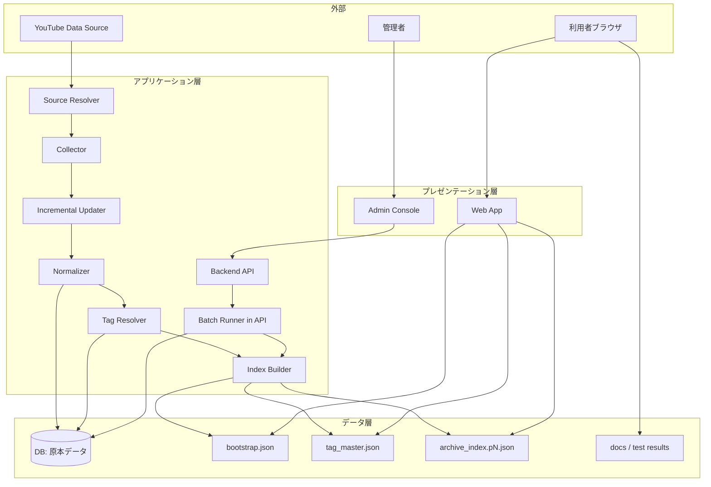

## 設計方針
- 収集対象（公式投稿 + [[RQ-GL-004|出演動画]]）を公開アーカイブに限定し、収集責務と配信責務を分離する。
- 収集・正規化・索引生成・検索表示を疎結合にし、将来の収集方式変更と検索方式拡張に耐える。
- 利用者体験は「高速初期表示」と「高精度絞り込み」を優先し、[[RQ-GL-010|段階ロード]]を採用する。
- 原本データはDBで一元管理し、利用者向け参照は配信用静的JSONを正規経路とする。
- Web公開層は Next.js App Router を前提に、Server Components を既定として `"use client"` 境界を最小化する。
- ドメイン境界は [[BD-SYS-DOM-001]] を正本として管理し、工程別文書体系（RQ/BD/DD/UT/IT/AT）に接続して追跡する。
- Publishing BC と Viewing BC 間の境界契約は `contracts/static-json/*.schema.json` を Published Language として固定し、契約変更時は両BC合意を必須とする。

## システム境界
- 本システムの責務は「公開動画メタデータの収集・加工・配信・検索」であり、動画本体配信はYouTube側責務とする。
- 収集対象判定は要件で定義した区分（公式/出演）に従い、判定結果をタグまたは区分属性として保存する。
- 表示対象は蓄積済み索引データのみとし、検索時に外部APIへ同期問い合わせしない。

## 論理コンポーネント
| コンポーネント | 主責務 | 主な入出力/対象 | 3層責務境界 |
|---|---|---|---|
| Source Resolver | 取得モード（公式取り込み/出演補完取り込み/差分更新）に応じて対象集合を解決する。 | YouTube/候補入力 -> 対象集合 | アプリケーション層 |
| Collector | [[RQ-GL-002|収集実行]]起動、対象動画列挙、メタデータ取得。 | 対象集合 -> 生メタデータ | アプリケーション層 |
| Incremental Updater | 既存データと照合し、更新種別（新規/既存/補完/再確認）を判定する。 | DB既存データ + 収集結果 -> 更新分類 | アプリケーション層 |
| Normalizer | 動画メタデータを内部スキーマへ変換し、重複と欠損を補正する。 | 収集データ -> 正規化データ | アプリケーション層 |
| Tag Resolver | [[RQ-GL-013|タグ種別]]辞書と動画タグを整合させ、DB正本を更新する。 | [[RQ-GL-005|タグ辞書]] + 動画タグ -> DB更新 | アプリケーション層 |
| Index Builder | 一覧検索向けに `bootstrap` と `archive_index.pN` を生成する。 | DB正本 -> 配信用JSON | アプリケーション層 |
| Static Distributor | 生成成果物（`bootstrap` / `tag_master` / `archive_index.pN`）を配信領域へ配置する。 | 配信用JSON -> 配信領域 | アプリケーション層 |
| Backend API | 管理画面からの更新要求を受け、DB更新と配信再生成を制御する。 | 管理操作要求 <-> DB/バッチ制御 | アプリケーション層 |
| Batch Runner | 収集/再確認/公開反映をBackend API（Hono）内で実行し、run状態を管理する。 | API起動 -> run実行/状態更新 | アプリケーション層 |
| Publish Orchestrator | [[RQ-GL-018|配信反映実行]]単位で成果物生成、公開切替、失敗時ロールバックを制御する。 | DB/生成物 -> 公開切替 | アプリケーション層 |
| Web App | [[RQ-GL-010|段階ロード]]、クライアント検索、絞り込み、詳細表示。 | 配信JSON -> 利用者表示 | プレゼンテーション層 |
| Admin Console/Runbook | 収集失敗検知、[[RQ-GL-011|再収集]]実行、タグ更新、配信反映判定、[[AT-GO-001|リリース判定]]。 | 運用者操作 <-> Backend API | プレゼンテーション層 |

## バッチ仕様参照
- バッチ一覧/バッチイベント一覧/バッチ実行制約の正本は [[BD-APP-API-002]] を参照する。
- 本書では「Batch RunnerをBackend API（Hono）内で実行する境界」と「外部スケジューラ起動」の構成方針のみを保持する。

## 3層責務境界
- プレゼンテーション層: `Web App` / `Admin Console` / `docs` を提供する。
- アプリケーション層: `Backend API` が更新系処理と配信生成トリガを担う。
- データ層: `DB` を正本とし、`S3配信用JSON` と `docs/テスト結果` を公開成果物として保持する。
- 将来の高度検索はアプリケーション層へ `検索API` を追加して段階導入する（現行MVPは静的JSON参照を継続）。

## 論理構成マッピング
- 論理構成の正本は [[BD-SYS-ARCH-002]] とし、以下の対応で本書の論理コンポーネントを4区分へ写像する。

| 論理構成（[[BD-SYS-ARCH-002]]） | 対応コンポーネント（本書） | マッピング方針 |
|---|---|---|
| フロントエンド | Web App, Admin Console/Runbook | 利用者表示と運用者操作のUI境界を担う。 |
| バックエンド（リアルタイムAPI） | Backend API | 実行要求受付、入力検証、run起票、状態照会の同期応答を担う。 |
| バックエンド（バッチ処理） | Batch Runner, Source Resolver, Collector, Incremental Updater, Normalizer, Tag Resolver, Index Builder, Static Distributor, Publish Orchestrator | 収集/整形/生成/公開切替の非同期実行責務を担う。 |
| インフラ | （本書では詳細を扱わず、配置・経路の正本を [[BD-SYS-ARCH-003]] 参照） | 配信経路と運用経路の分離、実行基盤提供を担う。 |
| データベース | （本書では `DB` を正本として参照し、データ構造正本を [[BD-APP-DATA-001]] 参照） | 原本データとrun状態の正本を担う。 |

## 読解導線（上から読む前提）
- 全体像把握: 本書（`システムコンテキスト`）
- 論理設計: [[BD-SYS-ARCH-002]]
- 物理配置設計: [[BD-SYS-ARCH-003]]
- データフロー設計: [[BD-SYS-ARCH-004]]
- API契約境界: [[BD-APP-API-001]] / [[BD-APP-API-002]]

## Web実行境界（Next.js App Router）
- Server Components を標準とし、状態保持・イベント処理・ブラウザAPI依存の部分だけを Client Components に切り出す。
- `cookies()` / `headers()` / `searchParams` など Dynamic API は末端境界でのみ利用し、Root Layout での無差別利用を禁止する。
- データ取得は Server Components で `fetch` / DB / 外部APIを直接呼び出し、Client からの更新系アクセスは Route Handlers 経由に限定する。
- Server から Route Handlers への自己HTTP呼び出しは採用しない（不要な往復レイテンシを回避する）。
- 逐次 await によるウォーターフォールを避けるため、並列取得と preload を優先し、`loading.tsx` と Suspense でストリーミング表示する。
- `<Link>` の prefetch は既定有効を維持し、無効化は副作用が明確な場合に限定する。

## 配置方針
- 配信面は静的ファイル配信を基本とし、閲覧トラフィックと収集処理を分離する。
- 収集面は定期実行と手動再実行を両立し、起動入口を同一運用APIに統一したうえで実行履歴を運用確認可能にする。
- 定期実行は外部スケジューラが運用APIを呼び出して開始し、実処理は単一Backend API（Hono）内で完結させる。
- 監視面は「収集成功率」「最新更新時刻」「配信エラー率」を最小必須指標とする。

## ドメイン境界と契約境界
- ドメイン境界は [[BD-SYS-DOM-001]] に従い、Ingestion/TagManagement/Publishing/Viewing/Administration/Analytics の5+1 BCで責務を固定する。
- BC間連携は Context Map で定義した関係（ACL / Customer-Supplier / Published Language / Shared Kernel / OHS）に従い、実装都合での越境参照を禁止する。
- Publishing BC から Viewing BC への公開契約は `contracts/static-json/*.schema.json` を Published Language として管理し、配信JSONの後方互換境界を機械検証で保証する。
- 境界契約を更新する場合は [[BD-SYS-ADR-029]] を起点に判断根拠・影響範囲・移行条件を追跡する。

## 図

## 品質属性への対応
- 可用性: 配信と収集を分離し、収集失敗時も既存索引の閲覧を継続可能にする。
- 性能: 初回は`bootstrap`のみで描画し、後続索引をバックグラウンド取得する。
- セキュリティ/コンプライアンス: 公開データのみを扱い、秘密情報を配信成果物へ含めない。
- 拡張性: [[RQ-GL-013|タグ種別]]と索引ページングを分離し、新しい分類軸追加時の影響を局所化する。

## 変更履歴
- 2026-02-19: 上から読む前提の読解導線を追加し、論理設計/物理配置設計の参照順を明示 [[BD-SYS-ADR-034]]
- 2026-02-15: 論理コンポーネントを表形式へ再編し、[[BD-SYS-ARCH-002]] への論理構成マッピングを追加 [[BD-SYS-ADR-033]]
- 2026-02-15: 論理構成正本（[[BD-SYS-ARCH-002]]）への参照を追加し、4区分とバックエンド内処理形態分離を明確化 [[BD-SYS-ADR-033]]
- 2026-02-15: ドメイン境界正本参照を [[BD-SYS-DOM-001]] へ移管し、旧DOM参照を廃止 [[BD-SYS-ADR-029]]
- 2026-02-14: バッチ仕様正本（一覧/イベント/実行制約/BAT-006入出力/同時実行制御）を [[BD-APP-API-002]] へ移管し、本書は境界方針の記述へ整理 [[BD-SYS-ADR-027]]
- 2026-02-14: DOM軸接続（現: [[BD-SYS-DOM-001]]）と Published Language（`contracts/static-json/*.schema.json`）の公式化を追加 [[BD-SYS-ADR-029]]
- 2026-02-13: BAT-006の入力スキーマ/出力契約/片系失敗時挙動と同時実行制御を追加 [[BD-SYS-ADR-027]]
- 2026-02-13: 変更履歴のADRリンク記載漏れを補正 [[BD-SYS-ADR-021]]
- 2026-02-12: 補助データ生成バッチ（BAT-006）、[[RQ-GL-008|タグマスター]]即時更新バッチ（BAT-007）、バッチ実行制約を追加 [[BD-SYS-ADR-021]]
- 2026-02-11: バッチ一覧/バッチイベント一覧を追加し、run状態と詳細設計参照を明確化 [[BD-SYS-ADR-021]]
- 2026-02-11: バッチ実処理を単一Backend API（Hono）内へ集約し、外部スケジューラはAPI起動のみ担う方式を追記 [[BD-SYS-ADR-021]]
- 2026-02-11: Next.js App Router前提のWeb実行境界（RSC/Client境界、Dynamic API、Route Handler、Suspense）を追加 [[BD-SYS-ADR-024]]
- 2026-02-11: 派生文書（ARCH-002/003/004, ERD, API-003, UI-003）とのトレースを追加 [[BD-SYS-ADR-021]]
- 2026-02-11: DB正本化と3層責務境界、将来検索API拡張境界を追加 [[BD-SYS-ADR-021]]
- 2026-02-11: 取得モード分離（Source Resolver/Incremental Updater）を追加し、PoC参照の収集責務を設計へ反映 [[BD-SYS-ADR-001]]
- 2026-02-10: 新規作成 [[BD-SYS-ADR-001]]
- 2026-02-10: コンポーネント責務、配置方針、品質属性対応を追加 [[BD-SYS-ADR-001]]
- 2026-02-10: ステークホルダー2者（管理者/利用者）に合わせて主体表現を修正 [[BD-SYS-ADR-001]]
