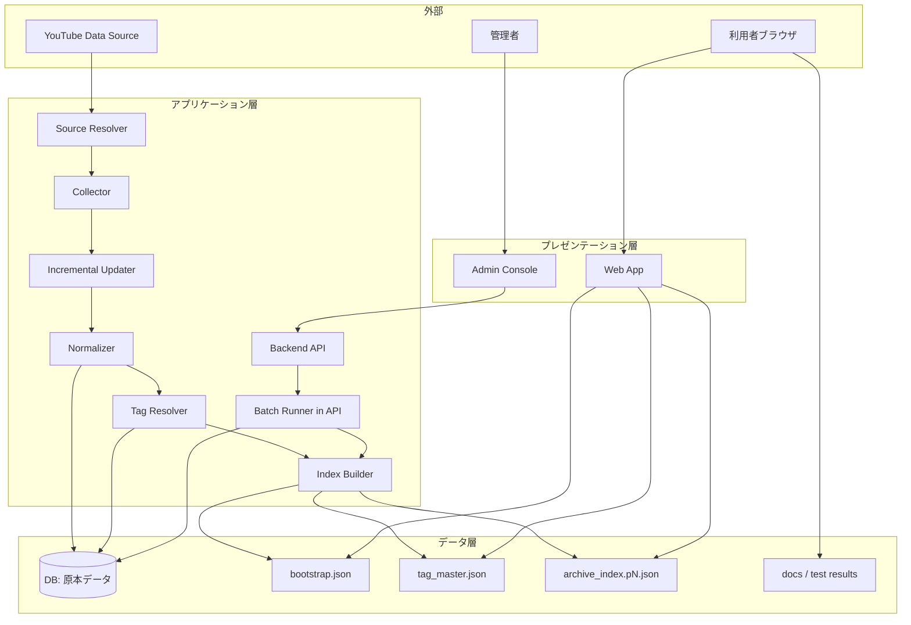

## 設計方針
- 収集対象（公式投稿 + [[RQ-GL-004|出演動画]]）を公開アーカイブに限定し、収集責務と配信責務を分離する。
- 収集・正規化・索引生成・検索表示を疎結合にし、将来の収集方式変更と検索方式拡張に耐える。
- 利用者体験は「高速初期表示」と「高精度絞り込み」を優先し、[[RQ-GL-010|段階ロード]]を採用する。
- 原本データはDBで一元管理し、利用者向け参照は配信用静的JSONを正規経路とする。
- Web公開層は Next.js App Router を前提に、Server Components を既定として `"use client"` 境界を最小化する。

## システム境界
- 本システムの責務は「公開動画メタデータの収集・加工・配信・検索」であり、動画本体配信はYouTube側責務とする。
- 収集対象判定は要件で定義した区分（公式/出演）に従い、判定結果をタグまたは区分属性として保存する。
- 表示対象は蓄積済み索引データのみとし、検索時に外部APIへ同期問い合わせしない。

## 論理コンポーネント
- Source Resolver: 取得モード（公式取り込み/出演補完取り込み/差分更新）に応じて対象集合を解決する。
- Collector: [[RQ-GL-002|収集ジョブ]]起動、対象動画列挙、メタデータ取得。
- Incremental Updater: 既存データと照合し、更新種別（新規/既存/補完/再確認）を判定する。
- Normalizer: 動画メタデータを内部スキーマへ変換し、重複と欠損を補正する。
- Tag Resolver: [[RQ-GL-013|タグ種別]]辞書と動画タグを整合させ、DB正本を更新する。
- Index Builder: 一覧検索向けに `bootstrap` と `archive_index.pN` を生成。
- Static Distributor: 生成成果物（`bootstrap` / `tag_master` / `archive_index.pN`）を配信領域へ配置する。
- Backend API: 管理画面からの更新要求を受け、DB更新と配信再生成を制御する。
- Batch Runner: 収集/再確認/公開反映をBackend API（Hono）内で実行し、run状態を管理する。
- Publish Orchestrator: [[RQ-GL-018|配信反映実行]] 単位で成果物生成、公開切替、失敗時ロールバックを制御する。
- Web App: [[RQ-GL-010|段階ロード]]、クライアント検索、絞り込み、詳細表示。
- Admin Console/Runbook: 収集失敗検知、[[RQ-GL-011|再収集]]実行、タグ更新、配信反映判定、[[RQ-GL-012|受入判定]]。

## バッチ一覧
| バッチID | バッチ名 | 起動契約 | 主な責務 | 状態遷移 | 詳細設計 |
|---|---|---|---|---|---|
| BAT-001 | 収集runバッチ | `POST /api/v1/ops/ingestion/runs` | 収集対象解決、収集実行、run採番/集計 | `queued -> running -> succeeded\|failed\|partial\|cancelled` | [[DD-APP-API-002]], [[DD-APP-API-003]], [[DD-APP-DB-010]] |
| BAT-002 | [[RQ-GL-011|再収集]]runバッチ | `POST /api/v1/ops/ingestion/runs/{runId}/retry` | 失敗run再実行、親run連結、再実行回数制御 | `queued -> running -> succeeded\|failed\|partial\|cancelled` | [[DD-APP-API-008]], [[DD-APP-API-003]], [[DD-APP-DB-010]] |
| BAT-003 | 配信前後再確認バッチ | `POST /api/v1/ops/rechecks` | 配信前後メタデータ差分判定、差分集計記録 | `queued -> running -> succeeded\|failed\|partial\|cancelled` | [[DD-APP-API-012]], [[DD-APP-DB-013]] |
| BAT-004 | 配信反映バッチ | `POST /api/v1/admin/publish/tag-master` | DB正本から成果物再生成、公開切替、失敗時ロールバック | `queued -> running -> succeeded\|failed\|rolled_back\|cancelled` | [[DD-APP-API-015]], [[DD-APP-DB-015]] |
| BAT-005 | docs公開バッチ | `POST /api/v1/admin/docs/publish` | docsビルド、配信反映、無効化処理 | `queued -> running -> succeeded\|failed\|rolled_back` | [[DD-APP-API-014]], [[DD-APP-DB-015]] |
| BAT-006 | 補助データ生成バッチ | 収集run完了トリガ（内部） | [[RQ-GL-016|コメント密度波形]]・[[RQ-GL-017|ワードクラウド]]生成 | `queued -> running -> succeeded\|failed\|partial` | [[DD-APP-API-004]], [[RQ-FR-022]], [[RQ-FR-023]] |
| BAT-007 | タグマスター即時更新バッチ | `POST /api/v1/admin/publish/tag-master`（publishScope=[[RQ-GL-008|tag_master]]） | [[RQ-GL-005|タグ辞書]]変更後の即時公開反映 | `queued -> running -> succeeded\|failed\|rolled_back` | [[DD-APP-API-013]], [[DD-APP-API-015]] |

## バッチイベント一覧
| イベントID | イベント名 | 発火条件 | 対象バッチ | 記録先 | 詳細設計 |
|---|---|---|---|---|---|
| BEV-001 | `queued` | API受理直後にrun作成 | BAT-001〜BAT-005 | `ingestion_runs` / `recheck_runs` / `publish_runs` の `status=queued` | [[DD-APP-DB-010]], [[DD-APP-DB-013]], [[DD-APP-DB-015]] |
| BEV-002 | `running` | 同一Backend API内ジョブ実行モジュールで処理開始 | BAT-001〜BAT-005 | runテーブル `status=running`、`started_at` | [[DD-APP-API-002]], [[DD-APP-API-012]], [[DD-APP-API-014]], [[DD-APP-API-015]] |
| BEV-003 | `succeeded` | 全ステップ成功で正常終了 | BAT-001〜BAT-005 | runテーブル終端状態、成功件数/公開時刻 | [[DD-APP-API-003]], [[DD-APP-API-012]], [[DD-APP-API-015]], [[DD-APP-DB-015]] |
| BEV-004 | `failed` | 非復旧エラーで終了 | BAT-001〜BAT-005 | `error_code`/`error_message`、監査ログ | [[DD-APP-API-003]], [[DD-APP-API-008]], [[DD-APP-API-014]], [[DD-APP-LOG-001]] |
| BEV-005 | `partial` | 一部対象のみ成功して終了 | BAT-001〜BAT-003 | 件数差分（`success_count`/`failed_count`/`unchanged_count`） | [[DD-APP-API-003]], [[DD-APP-API-012]], [[DD-APP-DB-010]], [[DD-APP-DB-013]] |
| BEV-006 | `rolled_back` | 公開切替失敗後に旧版へ切戻し完了 | BAT-004〜BAT-005 | `publish_runs.rollback_executed=true` | [[DD-APP-API-014]], [[DD-APP-API-015]], [[DD-APP-DB-015]] |
| BEV-007 | `cancelled` | 運用判断または安全停止で中断 | BAT-001〜BAT-004 | runテーブル終端状態 `cancelled` | [[DD-APP-API-003]], [[DD-APP-API-008]], [[DD-APP-API-012]], [[DD-APP-DB-010]] |

## バッチ実行制約
| バッチID | 最大実行時間 | Retry回数 | Retry間隔 | 同時実行数 | 備考 |
|---|---|---|---|---|---|
| BAT-001 | 60分 | 3回 | 30秒（指数バックオフ） | 1 | 外部API制限考慮 |
| BAT-002 | 30分 | 2回 | 1分 | 1 | 親runの制約を継承 |
| BAT-003 | 30分 | 2回 | 30秒 | 1 | - |
| BAT-004 | 15分 | 3回 | 30秒 | 1 | ロールバック時間含む |
| BAT-005 | 30分 | 2回 | 1分 | 1 | ビルド時間含む |
| BAT-006 | 60分 | 3回 | 30秒 | 3 | 動画単位で並列可 |
| BAT-007 | 10分 | 3回 | 15秒 | 1 | - |

## 3層責務境界
- プレゼンテーション層: `Web App` / `Admin Console` / `docs` を提供する。
- アプリケーション層: `Backend API` が更新系処理と配信生成トリガを担う。
- データ層: `DB` を正本とし、`S3配信用JSON` と `docs/テスト結果` を公開成果物として保持する。
- 将来の高度検索はアプリケーション層へ `検索API` を追加して段階導入する（現行MVPは静的JSON参照を継続）。

## BAT-006 入出力契約
- **起動イベント**: `S3 ObjectCreated` または収集run完了イベント。
- **入力スキーマ（必須）**: `video_id`, `channel_id`, `meta_type`, `message_text`。
- **波形生成入力条件**: `meta_type=textMessageEvent` の行のみ対象とし、検出パターン初期値は `草|w|くさ|kusa`。
- **[[RQ-GL-017|ワードクラウド]]入力条件**: 形態素抽出対象は `message_text`。公開チャット由来以外は処理対象外。
- **出力契約**: `highlights/{videoId}.json` と `wordcloud/{videoId}.png` を動画ID単位で再生成し、同一キー上書きで冪等性を担保する。
- **障害時挙動**: 波形/[[RQ-GL-017|ワードクラウド]]の片系失敗は `partial` とし、失敗成果物のみ前回確定版を維持する。

## 同時実行制御
- BAT-001〜BAT-005 は同時実行数1を維持し、実行中は同種runを受け付けない。
- BAT-006 は動画IDハッシュで最大3並列まで許容し、同一動画IDの重複実行は禁止する。
- 同時実行判定は run作成時にロックを取得し、失敗時は `409 RUN_ALREADY_ACTIVE` を返す。

## Web実行境界（Next.js App Router）
- Server Components を標準とし、状態保持・イベント処理・ブラウザAPI依存の部分だけを Client Components に切り出す。
- `cookies()` / `headers()` / `searchParams` など Dynamic API は末端境界でのみ利用し、Root Layout での無差別利用を禁止する。
- データ取得は Server Components で `fetch` / DB / 外部APIを直接呼び出し、Client からの更新系アクセスは Route Handlers 経由に限定する。
- Server から Route Handlers への自己HTTP呼び出しは採用しない（不要な往復レイテンシを回避する）。
- 逐次 await によるウォーターフォールを避けるため、並列取得と preload を優先し、`loading.tsx` と Suspense でストリーミング表示する。
- `<Link>` の prefetch は既定有効を維持し、無効化は副作用が明確な場合に限定する。

## 配置方針
- 配信面は静的ファイル配信を基本とし、閲覧トラフィックと収集処理を分離する。
- 収集面は定期実行と手動再実行を両立し、起動入口を同一運用APIに統一したうえで実行履歴を運用確認可能にする。
- 定期実行は外部スケジューラが運用APIを呼び出して開始し、実処理は単一Backend API（Hono）内で完結させる。
- 監視面は「収集成功率」「最新更新時刻」「配信エラー率」を最小必須指標とする。

## 図

## 品質属性への対応
- 可用性: 配信と収集を分離し、収集失敗時も既存索引の閲覧を継続可能にする。
- 性能: 初回は`bootstrap`のみで描画し、後続索引をバックグラウンド取得する。
- セキュリティ/コンプライアンス: 公開データのみを扱い、秘密情報を配信成果物へ含めない。
- 拡張性: [[RQ-GL-013|タグ種別]]と索引ページングを分離し、新しい分類軸追加時の影響を局所化する。

## 変更履歴
- 2026-02-13: BAT-006の入力スキーマ/出力契約/片系失敗時挙動と同時実行制御を追加 [[BD-SYS-ADR-027]]
- 2026-02-13: 変更履歴のADRリンク記載漏れを補正 [[BD-SYS-ADR-021]]
- 2026-02-12: 補助データ生成バッチ（BAT-006）、タグマスター即時更新バッチ（BAT-007）、バッチ実行制約を追加 [[BD-SYS-ADR-021]]
- 2026-02-11: バッチ一覧/バッチイベント一覧を追加し、run状態と詳細設計参照を明確化 [[BD-SYS-ADR-021]]
- 2026-02-11: バッチ実処理を単一Backend API（Hono）内へ集約し、外部スケジューラはAPI起動のみ担う方式を追記 [[BD-SYS-ADR-021]]
- 2026-02-11: Next.js App Router前提のWeb実行境界（RSC/Client境界、Dynamic API、Route Handler、Suspense）を追加 [[BD-SYS-ADR-024]]
- 2026-02-11: 派生文書（ARCH-002/003/004, ERD, API-003, UI-003）とのトレースを追加 [[BD-SYS-ADR-021]]
- 2026-02-11: DB正本化と3層責務境界、将来検索API拡張境界を追加 [[BD-SYS-ADR-021]]
- 2026-02-11: 取得モード分離（Source Resolver/Incremental Updater）を追加し、PoC参照の収集責務を設計へ反映 [[BD-SYS-ADR-001]]
- 2026-02-10: 新規作成 [[BD-SYS-ADR-001]]
- 2026-02-10: コンポーネント責務、配置方針、品質属性対応を追加 [[BD-SYS-ADR-001]]
- 2026-02-10: ステークホルダー2者（管理者/利用者）に合わせて主体表現を修正 [[BD-SYS-ADR-001]]
