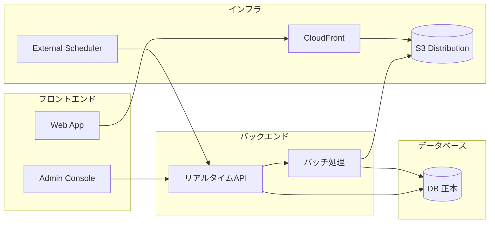

## 設計方針
- 論理構成は `フロントエンド` `バックエンド` `インフラ` `データベース` の4区分で定義し、責務境界を明示する。
- バックエンドは処理形態を `リアルタイムAPI` と `バッチ処理` に分離し、同期応答責務と非同期実行責務を混在させない。
- DBを正本として、管理画面操作と[[RQ-SH-002|利用者]]検索の依存方向を一方向に固定する。

## 設計要点
- フロントエンド:
  - `Web App` は[[RQ-SH-002|利用者]]向け参照を担い、配信済み静的成果物を読み込む。
  - `Admin Console` は運用操作（収集起動、タグ更新、配信反映）をバックエンドAPIへ委譲する。
- バックエンド:
  - `リアルタイムAPI` は管理画面/外部スケジューラからの要求を受け付け、認可・入力検証・状態遷移開始を同期応答で返す。
  - `バッチ処理` は収集run、再確認run、配信反映runを非同期で実行し、進行状態と結果をDBへ記録する。
  - `リアルタイムAPI` と `バッチ処理` は同一Backend API（Hono）内に配置し、論理責務として分離する。
- インフラ:
  - CloudFront経路分離、S3配信、運用API公開、監視を提供し、公開経路と運用経路を分離する。
- データベース:
  - DBは原本データとrun状態の正本として機能し、配信用JSON生成の入力源になる。

## バックエンド内部構成（処理形態）
- リアルタイムAPI:
  - 起点: `Admin Console` または外部スケジューラ。
  - 主責務: 実行要求受付、バリデーション、run採番、`queued` 記録、状態照会API提供。
  - 論理位置: バックエンド層の入口（同期I/O境界）。
- バッチ処理:
  - 起点: リアルタイムAPI受理後の内部ジョブ起動。
  - 主責務: 収集/再確認/公開反映の実処理、成果物生成、失敗時ロールバック、終端状態更新。
  - 論理位置: バックエンド層の実行コア（非同期処理境界）。

## 論理境界ルール
- 管理画面はDBへ直接アクセスしない。
- [[RQ-SH-002|利用者]]WebはDBや運用APIへ直接アクセスしない。
- 配信生成は公開切替単位（[[RQ-GL-018|配信反映実行]]）で実行し、失敗時は直前公開版へ戻す。
- 外部スケジューラはバッチ本体を直接実行せず、リアルタイムAPI起動のみを許可する。

## 図

## 変更履歴
- 2026-02-15: 論理構成を4区分（フロントエンド/バックエンド/インフラ/データベース）へ再編し、バックエンド内部をリアルタイムAPI/バッチ処理で明確化 [[BD-SYS-ADR-033]]
- 2026-02-11: DB正本前提の更新系/参照系分離と論理境界ルールを具体化 [[BD-SYS-ADR-021]]
- 2026-02-10: 新規作成 [[BD-SYS-ADR-001]]
