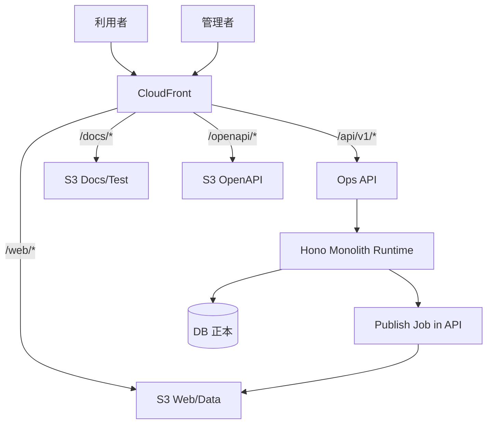

## 設計方針
- 単一CloudFront配下で経路分離し、公開面と運用面の境界を固定する。
- DB正本は非公開ネットワークに配置し、公開経路に露出させない。

## 設計要点
- `/web/*`: 利用者向けWebと静的データ配信。
- `/docs/*`: 文書とテスト結果ホスト。
- `/openapi/*`: 仕様公開（認証必須）。
- `/api/v1/*`: 管理画面向け運用API（認証必須）。
- DB正本、収集実行、配信生成は単一のBackend API（Hono）内で運用する。

## 配置ルール
- 公開オリジンはS3のみとし、DBは直接オリジンに含めない。
- 運用APIはCloudFront経由で公開するが、認証境界とrewrite禁止を維持する。
- 配信生成はBackend API内ジョブで実行し、生成完了後に公開パスを切替える。

## 図

## 変更履歴
- 2026-02-11: 収集/公開ジョブの実行境界を単一Backend API（Hono）内へ統一 [[BD-SYS-ADR-021]]
- 2026-02-11: DB非公開配置と経路分離のクラウド構成を具体化 [[BD-SYS-ADR-021]]
- 2026-02-10: 新規作成 [[BD-SYS-ADR-001]]
