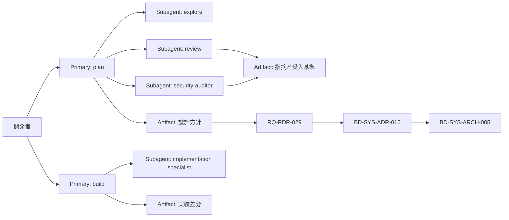

## 設計方針
- AIエージェント運用を「計画」「探索」「実装」「監査」の責務に分離し、役割ごとに権限と実行上限を固定する。
- 既存の文書運用統制（[[BD-INF-CM-001]], [[RQ-DG-001]]）と整合し、変更根拠を `RDR -> ADR -> 設計本文` で追跡できる構成とする。

## 設計要点
- Primaryは分析系と実装系を分離し、分析系は原則読み取り、実装系は段階解放で編集/実行を行う。
- Subagentは責務単位で分離し、探索（read-only）、レビュー（read-only）、監査（read-only）、実装補助（ask）を使い分ける。
- オーケストレーターは `permission.task` で呼び出し先を制限し、未許可サブエージェントの自動呼び出しを防止する。
- 調査系エージェントは実行ステップ上限を設け、上限到達時にサマリと未完了タスクを返す。

## 図

## 変更履歴
- 2026-02-11: 新規作成
