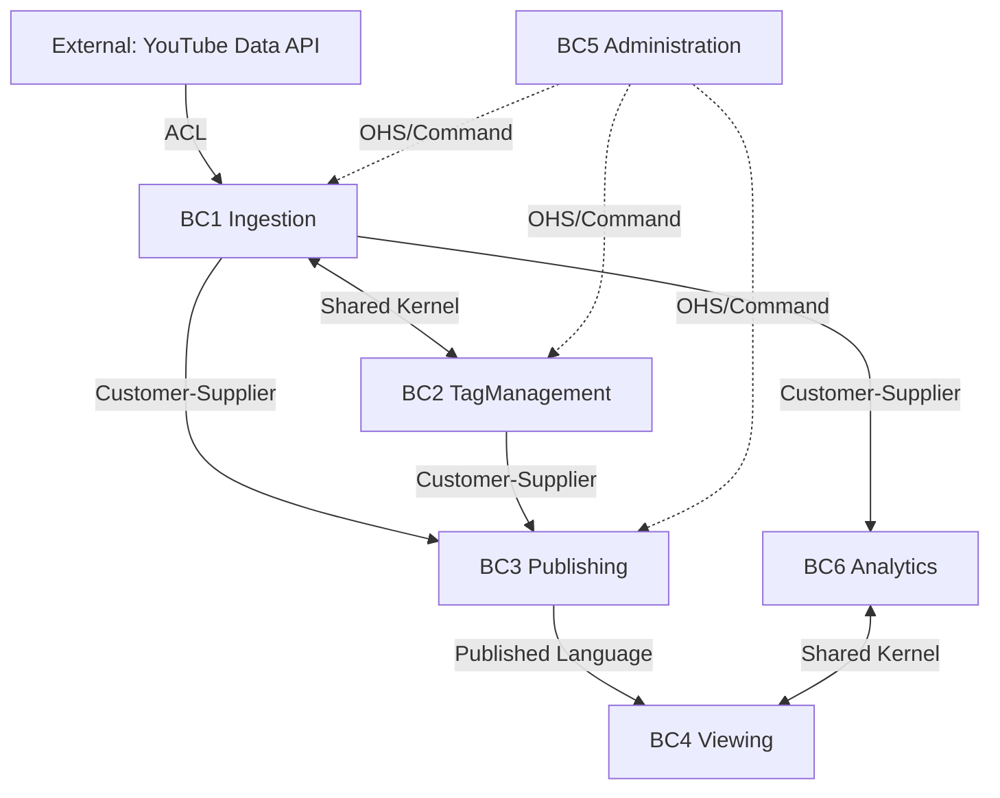

## 目的
- [[RQ-GL-001|diopside]] の境界づけられたコンテキストと境界間契約を、基本設計の正本として一元管理する。

## サブドメイン分類の定義
- コア（Core）は、利用者価値を直接成立させる機能責務であり、停止または品質低下が主要ユースケースの成立に直結する領域を指す。
- サポーティング（Supporting）は、コアの成立を支援する機能責務であり、単体では主要価値を完結しないが、運用継続性・品質維持に必要な領域を指す。
- 分類基準は「利用者価値への直接寄与」「停止時の価値毀損度」「差別化要素としての投資優先度」の3点で判定する。

## サブドメイン分類
| サブドメイン | 分類 | 理由 | 投資優先度 |
|---|---|---|---|
| Ingestion（収集） | Core | 公開アーカイブ収集・正規化・[[RQ-GL-002|収集実行]]状態管理はサービス価値の中核。 | 最優先 |
| TagManagement（タグ管理） | Core | [[RQ-GL-005|タグ辞書]]と割当品質が検索体験を直接規定する。 | 最優先 |
| Viewing（閲覧） | Core | 検索・絞り込み・[[RQ-GL-010|段階ロード]]・詳細表示が利用者価値を形成する。 | 最優先 |
| Publishing（配信） | Supporting | DB正本から配信成果物を生成・切替する実行基盤。 | 標準 |
| Administration（運用管理） | Supporting | 各コンテキスト操作を統制する調整役。 | 標準 |
| Analytics（分析） | Core | [[RQ-GL-016|コメント密度波形]]・[[RQ-GL-017|ワードクラウド]]は閲覧体験の理解性と再生導線を直接向上させる価値機能であり、本サービスの差別化要素を構成する。 | 最優先 |

## コンテキスト一覧
- BC1 Ingestion
- BC2 TagManagement
- BC3 Publishing
- BC4 Viewing
- BC5 Administration
- BC6 Analytics

## 関係図

## 境界契約パターン定義
- ACL（Anti-Corruption Layer）: 外部モデルの意味差を吸収する変換層を設け、内部モデルを外部仕様変更から保護する。
- Customer-Supplier（顧客-供給者）: 下流の利用要件を上流契約へ反映し、上流が責任を持って変更通知と供給品質を維持する。
- Published Language（公開言語）: 境界間で合意した共有契約を単一正本として公開し、後方互換境界を明示的に管理する。
- Shared Kernel（共有カーネル）: 複数コンテキストで共有する最小モデルを限定し、同時レビューで整合を維持する。
- OHS（Open Host Service）: 標準化した公開インタフェースを提供し、複数利用側からの運用コマンドや連携要求を受け付ける。

## 境界契約マトリクス
| 上流 | 下流 | パターン | 契約 |
|---|---|---|---|
| External（外部YouTube API） | Ingestion（収集） | ACL | 外部API応答を内部モデルへ変換し、外部仕様変化の影響を遮断する。 |
| Ingestion（収集） | Publishing（配信） | Customer-Supplier | `videos/channels` を中心に成果物生成へ供給する。 |
| TagManagement（タグ管理） | Publishing（配信） | Customer-Supplier | `tag_types/tags/video_tags` を供給し、`tag_master` 生成へ連携する。 |
| Publishing（配信） | Viewing（閲覧） | Published Language | `contracts/static-json/*.schema.json` を公式契約として扱う。 |
| Ingestion（収集） | TagManagement（タグ管理） | Shared Kernel | `videos/channels` を共有し、タグ割当の参照整合を維持する。 |
| Ingestion（収集） | Analytics（分析） | Customer-Supplier | 収集完了を契機に補助データ生成を開始する。 |
| Analytics（分析） | Viewing（閲覧） | Shared Kernel | [[RQ-DM-008]] / [[RQ-DM-009]] を共有する。 |
| Administration（運用管理） | Ingestion/TagManagement/Publishing（収集/タグ管理/配信） | OHS | 管理画面から運用コマンドをREST APIで発行する。 |

## BC責務サマリ
BC は Bounded Context（境界づけられたコンテキスト）を指す。

| BC | 主責務 | 主要機能要求（FR） | 主要ドメインモデル（DM） | 主要用語（GL） |
|---|---|---|---|---|
| Ingestion | 収集対象解決、正規化、実行状態管理 | [[RQ-FR-001]], [[RQ-FR-002]], [[RQ-FR-003]], [[RQ-FR-004]], [[RQ-FR-018]] | [[RQ-DM-001]], [[RQ-DM-002]], [[RQ-DM-005]], [[RQ-DM-006]] | [[RQ-GL-002]], [[RQ-GL-003]], [[RQ-GL-004]], [[RQ-GL-011]] |
| TagManagement | [[RQ-GL-013|タグ種別]]・[[RQ-GL-005|タグ辞書]]管理、タグ割当整合 | [[RQ-FR-005]] | [[RQ-DM-003]], [[RQ-DM-004]] | [[RQ-GL-005]], [[RQ-GL-008]], [[RQ-GL-013]] |
| Publishing | 配信成果物生成、公開切替、ロールバック | [[RQ-FR-006]], [[RQ-FR-019]], [[RQ-FR-024]] | [[RQ-DM-010]] | [[RQ-GL-006]], [[RQ-GL-007]], [[RQ-GL-009]], [[RQ-GL-018]] |
| Viewing | 検索/絞り込み/一覧/詳細、[[RQ-GL-010|段階ロード]] | [[RQ-FR-007]], [[RQ-FR-008]], [[RQ-FR-009]], [[RQ-FR-010]], [[RQ-FR-011]], [[RQ-FR-012]], [[RQ-FR-013]], [[RQ-FR-014]], [[RQ-FR-015]], [[RQ-FR-020]], [[RQ-FR-021]] | [[RQ-DM-007]], [[RQ-DM-008]], [[RQ-DM-009]] | [[RQ-GL-010]], [[RQ-GL-014]], [[RQ-GL-015]], [[RQ-GL-016]], [[RQ-GL-017]] |
| Administration | 収集/[[RQ-GL-011|再収集]]/公開運用/配信経路確認の統制 | [[RQ-FR-016]], [[RQ-FR-017]], [[RQ-FR-025]] | - | （対象BC用語を使用） |
| Analytics | 補助分析データ生成とViewing提供 | [[RQ-FR-022]], [[RQ-FR-023]] | [[RQ-DM-008]], [[RQ-DM-009]] | [[RQ-GL-015]], [[RQ-GL-016]], [[RQ-GL-017]] |

## 変更管理ルール
- Published Language変更は Publishing と Viewing の合意を必須とする。
- Shared Kernel変更は関係BCの同時レビューを必須とする。

## 変更履歴
- 2026-02-15: ドメイン境界からリリース管理語彙を除外し、収集責務を業務ドメイン語へ限定 [[BD-SYS-ADR-032]]
- 2026-02-15: Analytics（分析）をCoreへ再分類し、サブドメイン定義・境界契約パターン定義・略語定義と日本語併記を追加 [[BD-SYS-ADR-032]]
- 2026-02-15: 旧DOM文書群を統合し、基本設計のドメイン境界正本として新規作成 [[BD-SYS-ADR-029]]
