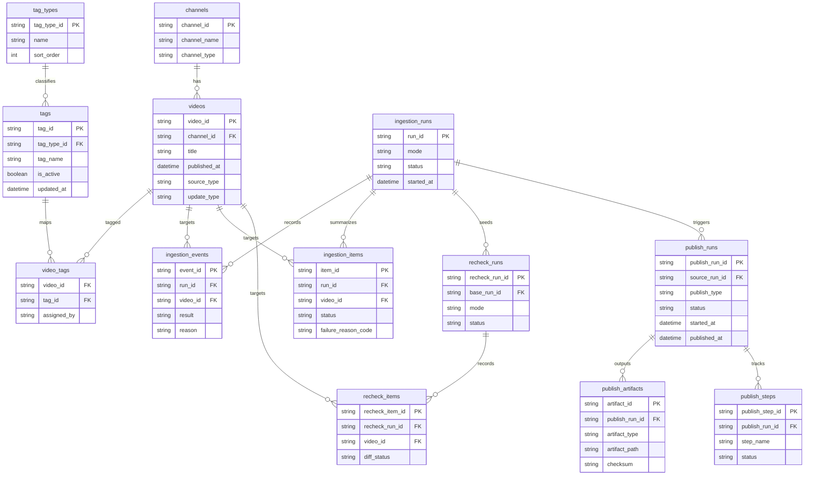

## 設計方針
- ERDはDB正本を中心に、[[RQ-GL-002|収集実行]]、タグ管理、公開反映の関係を示す。
- 利用者向け配信成果物はDB派生であり、ERDでは正本データのみを扱う。

## 設計要点
- `videos` を中心に `channels`、`video_tags`、`tags` を関連付ける。
- `ingestion_runs`、`ingestion_items`、`ingestion_events` で[[RQ-GL-002|収集実行]]履歴を保持する。
- `recheck_runs` と `recheck_items` で配信前後再確認履歴を保持する。
- `publish_runs`、`publish_steps`、`publish_artifacts` で公開反映履歴を保持する。

## 図

## 変更履歴
- 2026-02-19: ER図要点の `収集実行` 用語を GL 正本リンクへ統一 [[BD-SYS-ADR-034]]
- 2026-02-11: run明細/再確認/公開ステップをER図へ追加し、運用run追跡を具体化 [[BD-SYS-ADR-021]]
- 2026-02-11: DB正本と公開反映履歴を含むER図へ再構成 [[BD-SYS-ADR-021]]
- 2026-02-10: 新規作成 [[BD-SYS-ADR-001]]
