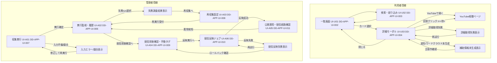

## 設計方針
- 画面遷移は「[[RQ-SH-002|利用者]]の探索導線」と「[[RQ-SH-001|管理者]]の運用導線」を分離して定義し、役割混在による迷いを防ぐ。
- 通常遷移だけでなく、取得失敗・競合・未生成時の復帰遷移を同じ図上で扱い、運用時の判断を画面設計に埋め込む。
- 一覧コンテキスト（[[RQ-GL-014|検索条件]]・スクロール位置）は[[DD-APP-UI-004|詳細モーダル]]往復で保持し、探索の連続性を維持する。

## 設計要点
- [[RQ-SH-002|利用者]]導線は「一覧を軸に詳細へ一時遷移して戻る」構造とし、外部遷移失敗時も一覧復帰可能とする。
- [[RQ-SH-001|管理者]]導線は run 単位の状態遷移（起動/監視/失敗調査/[[RQ-GL-011|再収集]]/確定）を前提に、各画面を順方向・逆方向どちらでも辿れるようにする。
- [[RQ-SH-001|管理者]]導線は run 状態と[[RQ-GL-018|配信反映実行]]状態を分離し、配信反映失敗時に旧公開版へ復帰できる導線を持つ。
- [[RQ-GL-016|コメント密度波形]]と[[RQ-GL-017|ワードクラウド]]は[[DD-APP-UI-004|詳細モーダル]]内の補助遷移として扱い、主遷移（開く/閉じる/外部遷移）を優先する。

## 画面遷移図

## 遷移定義
- [[DD-APP-UI-002|UI-U01]] -> [[DD-APP-UI-004|UI-U03]]: カード選択で遷移し、戻り時は [[RQ-GL-014|検索条件]] とスクロール位置を復元する（[[RQ-UC-006]]）。
- `詳細モーダル -> YouTube`: 通常遷移と `t=<秒>` 遷移の2系統を持ち、失敗時はURLコピー導線を表示してモーダル継続利用を可能にする（[[RQ-FR-014]], [[RQ-FR-020]]）。
- [[DD-APP-UI-007|UI-A01]] -> [[DD-APP-UI-006|UI-A02]]: run ID 発行後に `queued`/`running` を監視し、完了時に `succeeded`/`failed` を確定表示する（[[RQ-FR-001]], [[RQ-UC-001]]）。
- [[DD-APP-UI-006|UI-A02]] -> [[DD-APP-UI-008|UI-A03]]: 失敗原因分類後、対象runを引き継いで [[RQ-GL-011|再収集]] を起動する（[[RQ-UC-007]], [[RQ-UC-008]]）。
- [[DD-APP-UI-009|UI-A04]] -> [[DD-APP-UI-010|UI-A06]]: 差分確認と手動タグ付け確定後、[[RQ-GL-018|配信反映実行]]を起動して静的成果物を再生成する（[[RQ-FR-005]], [[RQ-FR-019]]）。
- [[DD-APP-UI-010|UI-A06]] -> [[DD-APP-UI-011|UI-A05]]: 反映成功後に公開作業へ進み、経路異常時は監視画面へ戻す（[[RQ-UC-009]], [[RQ-FR-024]], [[RQ-FR-025]]）。

## 例外時の復帰方針
- [[RQ-SH-002|利用者]]導線の例外は、原則として「一覧を失わずに再試行可能」とし、モーダル起点で復帰させる。
- [[RQ-SH-001|管理者]]導線の例外は、原則として「run単位で追跡可能」を維持し、失敗時も履歴画面をハブにする。
- 配信反映失敗時は旧公開版維持を前提に、配信前後確認画面へ戻って再試行判断できるようにする。
- 補助表示の失敗（[[RQ-GL-016|コメント密度波形]]/[[RQ-GL-017|ワードクラウド]]）は主操作を無効化しない。

## 変更履歴
- 2026-02-14: 遷移ノードと遷移定義に各画面DD-UIリンク（`DD-APP-UI-002`〜`DD-APP-UI-011`）を追加 [[BD-SYS-ADR-021]]
- 2026-02-11: 配信反映ジョブ導線（UI-A06）と[[RQ-GL-018|配信反映実行]]失敗復帰を追加 [[BD-SYS-ADR-021]]
- 2026-02-11: `publish run` 表記を [[RQ-GL-018|配信反映実行]] に統一 [[BD-SYS-ADR-021]]
- 2026-02-10: 新規作成 [[BD-SYS-ADR-001]]
- 2026-02-11: 画面遷移を[[RQ-SH-002|利用者]]/[[RQ-SH-001|管理者]]導線と例外復帰を含む遷移定義へ再構成 [[BD-SYS-ADR-010]]
