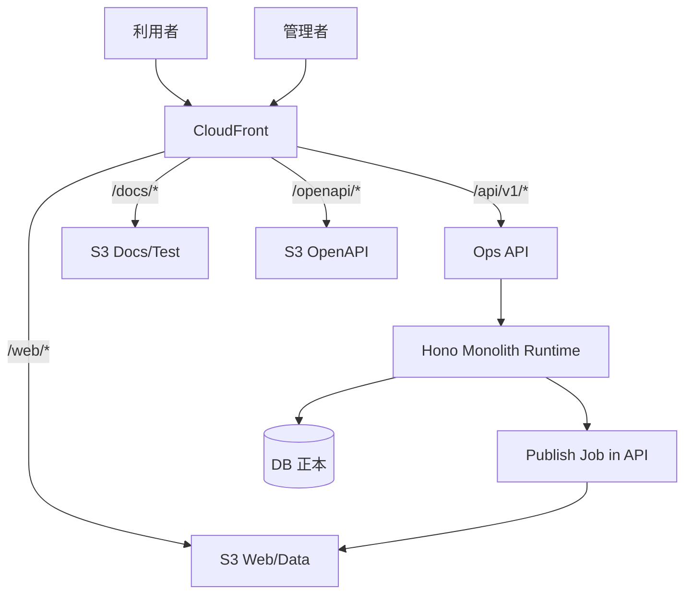

## 設計方針
- 単一CloudFront配下で経路分離し、公開面と運用面の境界を固定する。
- DB正本は非公開ネットワークに配置し、公開経路に露出させない。
- 配信境界、運用境界、監視境界を同一クラウド配置上で分離し、責務を固定する。

## 設計要点
- `/web/*`: [[RQ-SH-002|利用者]]向けWebと静的データ配信。
- `/docs/*`: 文書とテスト結果ホスト。
- `/openapi/*`: 仕様公開（認証必須）。
- `/api/v1/*`: 管理画面向け運用API（認証必須）。
- DB正本、[[RQ-GL-002|収集実行]]、配信生成は単一のBackend API（Hono）内で運用する。

## 配置ルール
- 公開オリジンはS3のみとし、DBは直接オリジンに含めない。
- 運用APIはCloudFront経由で公開するが、認証境界とrewrite禁止を維持する。
- 配信生成はBackend API内ジョブで実行し、生成完了後に公開パスを切替える。

## [[BD-SYS-ARCH-002|論理構成]]補足
- [[BD-SYS-ARCH-002|論理構成]]の正本は [[BD-SYS-ARCH-002]] とし、本書のクラウド配置は `フロントエンド` `バックエンド` `インフラ` `データベース` の4区分に対応づけて解釈する。
- バックエンドは `リアルタイムAPI` と `バッチ処理` の2処理形態に分離し、配置上は同一Backend API（Hono）に集約する。
- 外部スケジューラはリアルタイムAPI起動のみを担い、バッチ本体への直接起動経路を持たない。

## 境界運用
- 配信境界:
  - 公開経路は `/web/*` と `/docs/*`。
  - 管理/契約経路は `/api/v1/*` と `/openapi/*`。
- 運用境界:
  - 配備入口は `task docs:deploy` を正本とし、経路単位でinvalidationする。
  - 切戻しは「前回公開版への復帰」を第一選択とし、全体切戻しは緊急時のみ許可する。
- 監視境界:
  - `/web` `/docs` `/openapi` `/api/v1` の経路別4xx/5xx率を分離して監視する。
  - 可用性、性能、セキュリティ、ログ品質を日次で判定し、受入文書に転記する。

## 障害時の基本動作
- 配信障害は経路単位で一次切り分けし、影響経路のみを再配備する。
- API障害は認証失敗とアプリ失敗を分離し、認証基盤障害の誤判定を防ぐ。
- 監視欠測は可用性判定を保留し、欠測回復後に再判定する。

## 図

## 変更履歴
- 2026-02-15: [[BD-SYS-ARCH-002|論理構成]]正本（[[BD-SYS-ARCH-002]]）との対応を追記し、4区分とバックエンド内処理形態分離を配置視点で明確化 [[BD-SYS-ADR-033]]
- 2026-02-14: `BD-SYS-ARCH-006` を本書へ統合し、配信/運用/監視境界と障害時動作を一本化 [[BD-SYS-ADR-014]]
- 2026-02-11: 収集/公開ジョブの実行境界を単一Backend API（Hono）内へ統一 [[BD-SYS-ADR-021]]
- 2026-02-11: DB非公開配置と経路分離のクラウド構成を具体化 [[BD-SYS-ADR-021]]
- 2026-02-10: 新規作成 [[BD-SYS-ADR-001]]
