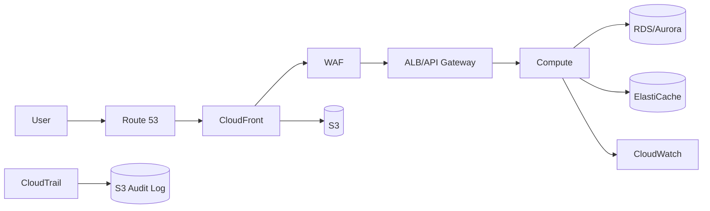

## 設計方針
- インフラ基本設計の章構成を「リソース起点 + Well-Architected整合」で再編する。
- 各章は `目的/必須設計項目/未指定事項/関連DD` を持ち、DDへ渡す入力を欠落させない。
- 方針だけで進められる項目と、数値確定が必須な項目を分離して記録する。

## 新章構成（INF）
1. スコープと全体構成（本書）
2. アカウントと環境 `[[BD-INF-ENV-001]]`
3. IAMとセキュリティ `[[BD-INF-SEC-001]]`
4. ネットワーク `[[BD-INF-NET-001]]`
5. エッジとDNS `[[BD-INF-DEP-004]]`
6. L7防御 `[[BD-INF-WAF-001]]`
7. コンピュートと配備 `[[BD-INF-DEP-005]]`
8. データストア `[[BD-INF-PLAT-002]]`
9. 暗号化と鍵管理 `[[BD-INF-KMS-001]]`
10. 監視と可観測性 `[[BD-INF-MON-001]]`
11. 監査と証跡 `[[BD-INF-AUD-001]]`
12. DRとバックアップ `[[BD-INF-DEP-006]]`
13. CI/CD `[[BD-INF-DEP-003]]`
14. IaCと構成管理 `[[BD-INF-IAC-001]]`, `[[BD-INF-CM-001]]`
15. 運用ガバナンス `[[BD-INF-OPS-001]]`

## 図

## 未指定事項（先行で埋める）
- リージョン/AZ数、ピークトラフィック、同時接続数。
- RTO/RPO、データ分類、保持期間、コンプライアンス要件。
- WAF/Shield導入段階、KMSキー分割方針、DR演習頻度。

## 正本境界
- 変更統制: `[[BD-INF-IAC-001]]`
- 配備境界: `[[BD-INF-DEP-005]]`
- 実装値（CIDR/IAM policy/閾値/Runbook）: DD文書を正本とする。

## 変更履歴
- 2026-02-20: INF章構成をAWSリソース起点へ再編し、章テンプレートと未指定項目管理を追加 [[BD-SYS-ADR-036]]
- 2026-02-14: INF全体像へ監視・イベント責務を追加し、正本参照を `DD-INF-MON-*` / `BD-APP-API-002` へ明示 [[BD-SYS-ADR-031]]
- 2026-02-13: CDKオンリー運用とAs-Is/To-Be分離方針を追記 [[BD-SYS-ADR-028]]
- 2026-02-13: 管理対象AWSサービス一覧（個数/構築理由/導入段階/除外ルール）を追加 [[BD-SYS-ADR-028]]
- 2026-02-13: 正本境界（INF親文書/変更フロー/配信配備/DD実装値）の責務を明確化 [[BD-SYS-ADR-028]]
- 2026-02-13: 新規作成（インフラ文書体系の親文書を追加） [[BD-SYS-ADR-028]]
