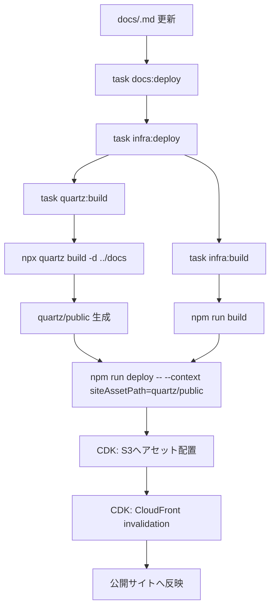

## 目的
- Quartz と infra（AWS CDK）を連携したドキュメント公開フローの実行順序と責務分担を明確化する。

## 必須設計項目
- パイプライン入口（手動/自動）と承認境界。
- IaC差分確認（`cdk diff`）と配備条件。
- 成果物境界（docs/openapi/web）と配信経路。
- 失敗時ロールバック判定と監査記録。

## 前提
- 将来運用では `quartz/` と `infra/` を同一リポジトリ配下に配置し、`task docs:deploy` を公開標準コマンドとして提供する。
- 公開対象は Obsidian文書をQuartzでビルドした静的成果物（`quartz/public`）とする。

## CornellNoteWeb準拠ポイント
- 運用入口をTaskへ統一し、公開手順の人依存を排除する。
- IaC（CDK）を唯一の配備経路とし、手動アップロード運用を採用しない。
- 運用手順（公開/障害対応）を受入文書へ反映し、品質ゲートと一体で運用する。

## 公開フロー（全体）

## 実行チェーン
- 標準コマンドは `task docs:deploy` を使用する。
- `docs:deploy` は `infra:deploy` を呼び出す。
- `infra:deploy` は依存として `quartz:build` と `infra:build` を実行する。
- `quartz:build` は `npx quartz build -d ../docs` により `quartz/public` を生成する。
- `infra:deploy` は `npm run deploy -- --context siteAssetPath=<repo>/quartz/public` を実行し、配信元アセットを明示する。

## CDK決定性方針
- `cdk synth` は副作用ゼロを前提とし、デプロイ時以外にAWSリソース変更を発生させない。
- synth時の外部ネットワーク依存を最小化し、`fromLookup` で取得した値は `cdk.context.json` に固定してコミットする。
- 環境差分はStage/propsで表現し、Construct/Stack内部の `process.env` 直接参照を禁止する。
- statefulリソースを含む変更では、論理ID変更有無をレビュー観点へ追加する。

## CI/CD設計
- `docs-link-check`:
  - 対象: docs markdown変更
  - 役割: 用語リンク補正チェックと整合検証（`auto_link_glossary --check`、`validate_vault --targets`）
- `docs-pdf`:
  - 起動: docs markdown / `scripts/docs_pdf/**` / `Taskfile.yaml` / workflow変更時
  - 役割: `task docs:pdf` で単一PDFを生成し、Actions Artifactとして配布する。
  - Artifact名: `diopside-docs-{branch}-{shortsha}.zip`（中身は `diopside-docs-{branch}-{shortsha}.pdf`）
- `release-docs-pdf`:
  - 起動: GitHub Release `published`
  - 役割: `task docs:pdf` の成果物をRelease Assetsへ添付し、Release画面から直接ダウンロード可能にする。
  - 配布名: `diopside-docs-{branch}-{shortsha}.pdf`（branchは `github.event.release.target_commitish` を同一規則で正規化）
  - 上書き方針: 同名Assetは `--clobber` で置換する。
- `docs-deploy`:
  - 起動: `workflow_dispatch` と `push(main)`（`docs/**`, `infra/**`, `config/quartz/**`, `Taskfile.yaml`, workflow変更）
  - 実行環境: `environment: prod` を必須化し、Environment保護ルールで承認境界を管理する。
  - 役割: OIDC認証 -> `task docs:deploy`（`docs:guard` + `infra:deploy` + `docs:verify`）
  - 認証: `aws-actions/configure-aws-credentials@v6` で `AWS_ROLE_ARN` を Assume し、長期キーを使用しない。
  - 直列化: `concurrency: docs-deploy-prod` を固定し、同時配備を禁止する。

## cdk-nag品質ゲート
- `infra` のCDK合成時に `AwsSolutionsChecks` を適用し、未承認の警告/エラーを残したまま配備しない。
- 除外（suppressions）は恒久設定ではなく、根拠・適用範囲・将来の解消条件を文書化したもののみ許可する。
- 現行Phase 1（docs単独公開）で許可する除外は次のとおり。
  - `AwsSolutions-IAM4` / `AwsSolutions-IAM5` / `AwsSolutions-L1`: `BucketDeployment` が生成するCDK管理カスタムリソース由来（スタック[[RQ-SH-002|利用者]]側で直接制御不可）。
  - `AwsSolutions-S1`: S3アクセスログはPhase 1では未導入（CloudFront配信を主体とし運用コストを抑制）。
  - `AwsSolutions-CFR1`: 公開文書のグローバル配信要件によりGeo制限を未適用。
  - `AwsSolutions-CFR2`: WAFはPhase 1で未導入（Phase 2の単一CloudFront運用で再評価）。
  - `AwsSolutions-CFR3`: CloudFrontアクセスログはPhase 1で未導入（監視基盤拡張時に再評価）。
  - `AwsSolutions-CFR4`: Phase 1ではCloudFront標準証明書を許容し、カスタムドメイン導入時に解消。

## 段階導入方針
- Phase 1（先行）
  - 対象: `/docs/*` の公開のみ
  - 目的: `task docs:deploy` による再現可能な公開フローを先に安定化
- Phase 2（拡張）
  - 対象: 単一CloudFrontで `/web/*`, `/docs/*`, `/openapi/*`, `/api/v1/*` を分岐
  - 設計正本: [[BD-INF-DEP-004]] / [[DD-INF-DEP-002]]

## 配信実装（infra）
- `QuartzSiteStack` は `siteAssetPath` context（未指定時は `../../quartz/public`）を参照する。
- `QuartzSiteStack` は GitHub OIDC Provider（`token.actions.githubusercontent.com`）と `GithubActionsDeployRole` を同一スタックで構築する。
- `GithubActionsDeployRole` のTrust条件は `aud=sts.amazonaws.com` かつ `sub=repo:tsuji-tomonori/diopside-v3:environment:prod` を必須にする。
- Assume先ロールARNは `GithubActionsDeployRoleArn` Output で公開し、GitHub Environment `prod` の `AWS_ROLE_ARN` へ設定する。
- `BucketDeployment` で `siteAssetPath` を S3 の `obsidian/` プレフィックスへ配置する。
- CloudFront Distribution は S3 Origin + OAC 構成で、S3 バケットは公開禁止（`BLOCK_ALL`）とする。
- デプロイ時に `distributionPaths: ["/*"]` を指定し、CloudFront のキャッシュを無効化する。

## URL ルーティング
- CloudFront Function（`pretty-url-rewrite.js`）で拡張子なしURLを `.html` へ補完する。
- `/` と `/docs/` へのアクセスは `index.html` へリライトし、Quartzデフォルトの公開トップへ解決する。
- `/path/` 形式は `index.html` を補完する。

## 失敗時の確認観点
- Quartz build 失敗時: `docs/` の Markdown 記法とリンク不整合を確認し、再度 `task quartz:build` を実行する。
- CDK deploy 失敗時: AWS 認証情報（`CDK_DEFAULT_ACCOUNT`/`CDK_DEFAULT_REGION`）と `siteAssetPath` の解決パスを確認する。
- OIDC Assume失敗時: `AWS_ROLE_ARN` の値、Trust Policyの `aud/sub`、GitHub Environment名（`prod`）の一致を確認する。
- 反映遅延時: CloudFront invalidation の完了状態を確認し、必要時に再デプロイする。

## 変更履歴
- 2026-02-21: `docs-deploy.yml` を `push(main)` + `environment: prod` + OIDC AssumeRole運用で実装し、初回ローカル配備後にGitHubへ移行する手順を追加 [[BD-SYS-ADR-038]]
- 2026-02-21: `docs-pdf` のArtifact名を `.zip` とし、Release配布は `.pdf` を維持する運用へ更新 [[BD-SYS-ADR-037]]
- 2026-02-21: `docs-pdf` / `release-docs-pdf` の配布経路と `diopside-docs-{branch}-{shortsha}.pdf` 命名規則を追加 [[BD-SYS-ADR-037]]
- 2026-02-20: 章再編に合わせてCI/CD必須設計項目を追加 [[BD-SYS-ADR-036]]
- 2026-02-11: CDK決定性方針（副作用ゼロ、context固定、props注入、論理IDレビュー）を追加
- 2026-02-11: 公開トップのリライト先を `RQ-HM-001.html` から `index.html` へ変更
- 2026-02-11: cdk-nag品質ゲートと除外許可条件（Phase 1限定の根拠）を追記
- 2026-02-11: CornellNoteWeb準拠ポイント、CI/CD分離設計、Phase 1/2の段階導入方針を追記
- 2026-02-11: 新規作成
