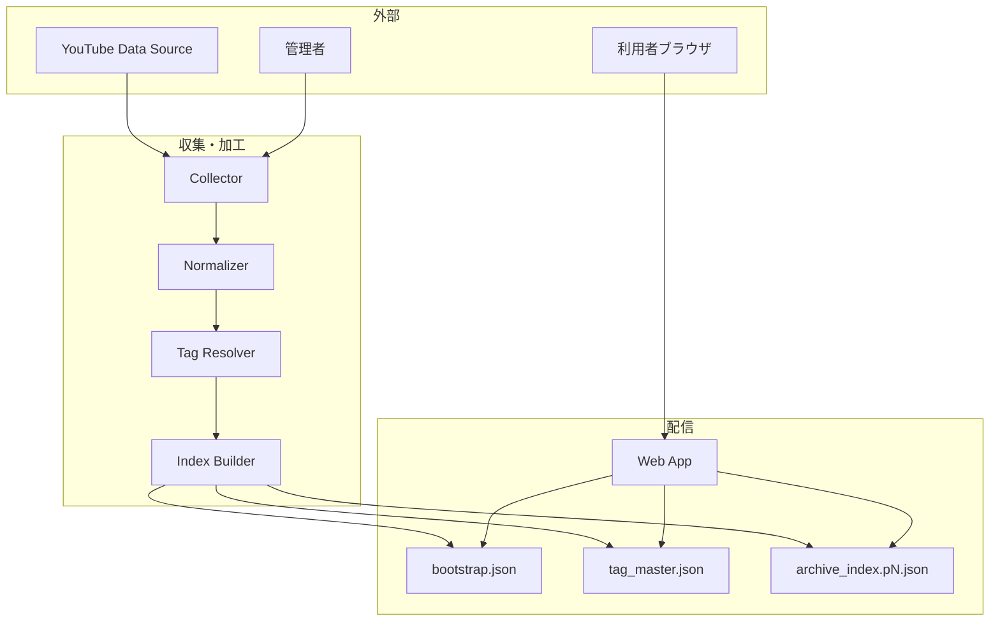

## 設計方針
- 収集対象（公式投稿 + [[RQ-GL-004|出演動画]]）を公開アーカイブに限定し、収集責務と配信責務を分離する。
- 収集・正規化・索引生成・検索表示を疎結合にし、将来の収集方式変更に耐える。
- 利用者体験は「高速初期表示」と「高精度絞り込み」を優先し、[[RQ-GL-010|段階ロード]]を採用する。

## システム境界
- 本システムの責務は「公開動画メタデータの収集・加工・配信・検索」であり、動画本体配信はYouTube側責務とする。
- 収集対象判定は要件で定義した区分（公式/出演）に従い、判定結果をタグまたは区分属性として保存する。
- 表示対象は蓄積済み索引データのみとし、検索時に外部APIへ同期問い合わせしない。

## 論理コンポーネント
- Collector: [[RQ-GL-002|収集ジョブ]]起動、対象動画列挙、差分取得。
- Normalizer: 動画メタデータを内部スキーマへ変換し、重複と欠損を補正。
- Tag Resolver: [[RQ-GL-013|タグ種別]]辞書と動画タグを整合させ、`tag_master` を生成。
- Index Builder: 一覧検索向けに `bootstrap` と `archive_index.pN` を生成。
- Static Distributor: 生成成果物を配信領域へ配置し、公開UIへ提供。
- Web App: [[RQ-GL-010|段階ロード]]、クライアント検索、絞り込み、詳細表示。
- Admin Console/Runbook: 収集失敗検知、[[RQ-GL-011|再収集]]実行、[[RQ-GL-012|受入判定]]。

## 配置方針
- 配信面は静的ファイル配信を基本とし、閲覧トラフィックと収集処理を分離する。
- 収集面は定期実行と手動再実行を両立し、実行履歴を運用確認可能にする。
- 監視面は「収集成功率」「最新更新時刻」「配信エラー率」を最小必須指標とする。

## 図

## 品質属性への対応
- 可用性: 配信と収集を分離し、収集失敗時も既存索引の閲覧を継続可能にする。
- 性能: 初回は`bootstrap`のみで描画し、後続索引をバックグラウンド取得する。
- セキュリティ/コンプライアンス: 公開データのみを扱い、秘密情報を配信成果物へ含めない。
- 拡張性: [[RQ-GL-013|タグ種別]]と索引ページングを分離し、新しい分類軸追加時の影響を局所化する。

## 変更履歴
- 2026-02-10: 新規作成
- 2026-02-10: コンポーネント責務、配置方針、品質属性対応を追加
- 2026-02-10: ステークホルダー2者（管理者/利用者）に合わせて主体表現を修正
