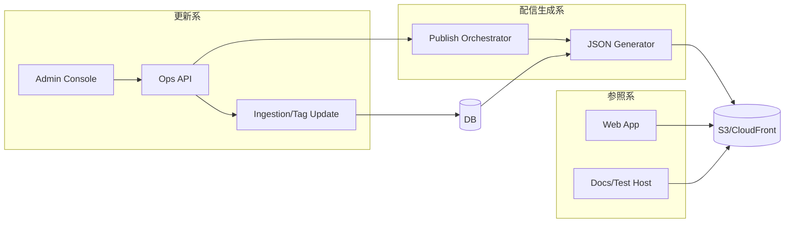

## 設計方針
- 論理構成は「更新系」「配信生成系」「参照系」を分離し、責務の混在を防ぐ。
- DBを正本として、管理画面操作と利用者検索の依存方向を一方向に固定する。

## 設計要点
- 更新系コンテキスト: 管理画面、運用API、収集実行、タグ更新、配信反映制御。
- 配信生成コンテキスト: DB正本から `bootstrap` / `tag_master` / `archive_index.pN` を生成する。
- 参照系コンテキスト: 利用者Webは配信済み静的成果物のみ参照する。
- 将来拡張コンテキスト: API検索エンドポイント追加時も更新系との境界を維持する。

## 論理境界ルール
- 管理画面はDBへ直接アクセスしない。
- 利用者WebはDBや運用APIへ直接アクセスしない。
- 配信生成は公開切替単位（[[RQ-GL-018|配信反映実行]]）で実行し、失敗時は直前公開版へ戻す。

## 図

## 変更履歴
- 2026-02-11: DB正本前提の更新系/参照系分離と論理境界ルールを具体化 [[BD-ADR-021]]
- 2026-02-10: 新規作成 [[BD-ADR-001]]
