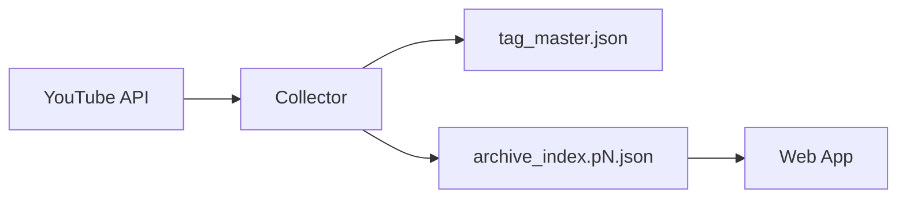

## 設計方針
- クラウド配置構成として[[RQ-GL-001|diopside]]の基本設計を定義する。
- 収集対象（公式+出演）を前提に設計する。

## 設計要点
- 公開データの収集・正規化・索引生成を分離する。
- Web配信は静的JSON + フロント検索を採用する。
- 運用監視と[[RQ-GL-011|再収集]]導線を設計に含める。

## 図

## 変更履歴
- 2026-02-10: 新規作成
