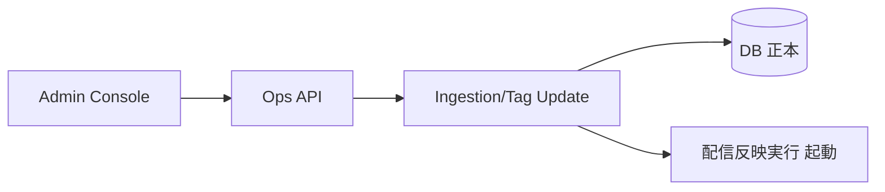
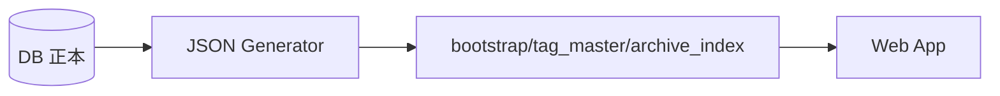

## 設計方針
- 主要データフローは「更新系」「配信生成」「参照系」の3本で定義する。
- DB正本を中心に、公開データは生成成果物として扱う。

## 設計要点
- 更新系: 収集実行、タグ更新、[[RQ-GL-011|再収集]]、公開判定をDBへ記録する。
- 配信生成: [[RQ-GL-018|配信反映実行]]単位で配信用JSONを生成し、品質検証後に公開切替する。
- 参照系: 利用者検索は公開済みJSONを読み込み、同期的なDB問い合わせを行わない。

## 更新系フロー

## 参照系フロー

## 失敗時フロー
- DB更新失敗: [[RQ-GL-018|配信反映実行]]を開始せず更新APIで失敗応答する。
- 生成失敗: 直前公開版を維持し、再試行対象として[[RQ-GL-018|配信反映実行]]を記録する。
- 公開切替失敗: 旧公開版へロールバックし、運用画面で原因を確認可能にする。

## 変更履歴
- 2026-02-11: 更新系/参照系/失敗時を分離したデータフローへ再構成 [[BD-ADR-021]]
- 2026-02-10: 新規作成 [[BD-ADR-001]]
