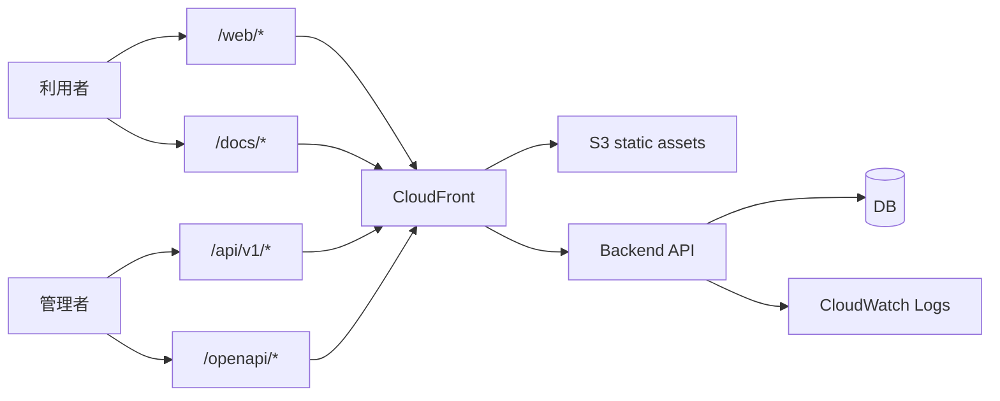

## 設計方針
- インフラは配信境界、運用境界、監視境界の3面で分離し、責務を固定する。
- 利用者導線と管理導線を同一CloudFront上で分離し、認証境界を経路で判定可能にする。

## 境界構成

## 設計要点
- 配信境界:
  - 公開経路は `/web/*` と `/docs/*`。
  - 管理/契約経路は `/api/v1/*` と `/openapi/*`。
- 運用境界:
  - 配備入口は `task docs:deploy` を正本とし、経路単位でinvalidationする。
  - 切戻しは「前回公開版への復帰」を第一選択とし、全体切戻しは緊急時のみ許可する。
- 監視境界:
  - `/web` `/docs` `/openapi` `/api/v1` の経路別4xx/5xx率を分離して監視する。
  - 可用性、性能、セキュリティ、ログ品質を日次で判定し、受入文書に転記する。

## 障害時の基本動作
- 配信障害は経路単位で一次切り分けし、影響経路のみを再配備する。
- API障害は認証失敗とアプリ失敗を分離し、認証基盤障害の誤判定を防ぐ。
- 監視欠測は可用性判定を保留し、欠測回復後に再判定する。

## 変更履歴
- 2026-02-11: 新規作成（配信/運用/監視の3境界アーキテクチャ） [[BD-ADR-014]]
- 2026-02-11: 監視文脈のADR参照を整理（経路境界/監視SLO/CloudWatch保持） [[BD-ADR-022]]
- 2026-02-13: Mermaid経路ノードを引用ラベルへ修正（描画エラー回避） [[BD-ADR-014]]
