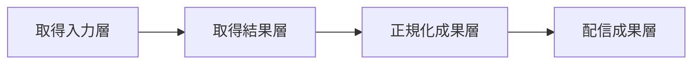

## 設計方針
- 収集データは「取得入力」「取得結果」「配信用正規化成果物」を分離し、追跡可能性と再処理可能性を担保する。
- 取得元区分（公式/出演補完/差分更新）と更新種別（新規/既存/補完/再確認）を全レコードで保持する。
- [[RQ-PC-003]] と [[RQ-PRC-001]] に基づき、コメント本文/チャット本文/字幕本文の恒久保存は行わない。

## データ層構成
| 層 | 目的 | 主な保持項目 |
|---|---|---|
| 取得入力層 | runごとの対象定義と条件再現 | `run_id`, `mode`, `target_scope`, `candidate_source_ref`, `requested_at` |
| 取得結果層 | 上流取得の結果記録と品質判定 | `video_id`, `source_type`, `update_type`, `fetch_status`, `failure_reason` |
| 正規化成果層 | 検索/表示用の統一スキーマ | 必須属性（動画ID/タイトル/公開日時/チャンネル区分）+ 任意属性（説明/再生時間/タグ等） |
| 配信成果層 | Web配信用の静的成果物 | `bootstrap`, `tag_master`, `archive_index.pN`, 補助表示成果物 |

## スキーマ境界
- **必須属性**: `video_id`, `title`, `published_at`, `channel_type`。
- **任意属性**: `description`, `duration`, `tags`, `thumbnail_ref`。
- **追跡属性**: `run_id`, `source_type`, `update_type`, `normalized_at`。
- **品質属性**: `missing_fields`, `validation_status`, `supplement_required`。

## データライフサイクル
1. 取得入力層でrun条件を確定する。
2. 取得結果層へ対象動画ごとの取得成否と追跡属性を記録する。
3. 正規化成果層で必須/任意属性を分離して整形する。
4. 品質検証を通過したデータのみ配信成果層へ反映する。

## 品質ゲート
- `video_id` 重複は受け入れず、競合時は配信反映を停止する。
- 取得元区分と更新種別の欠落レコードは配信対象から除外する。
- 任意属性欠損は補完対象として識別し、欠損理由を保持する。

## 図

## 変更履歴
- 2026-02-11: データ層構成、追跡属性、品質ゲートを追加し収集モード分離へ対応
- 2026-02-10: 新規作成
