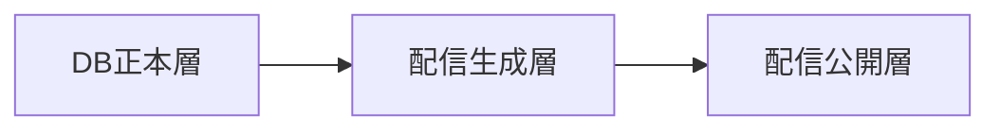

## 設計方針
- 収集データは「DB正本」「配信用成果物」を分離し、更新系と参照系の責務境界を維持する。
- 取得元区分（公式/出演補完/差分更新）と更新種別（新規/既存/補完/再確認）を全レコードで保持する。
- [[RQ-PC-003]] と [[RQ-PRC-001]] に基づき、コメント本文/チャット本文/字幕本文の恒久保存は行わない。

## データ層構成
| 層 | 目的 | 主な保持項目 |
|---|---|---|
| DB正本層 | 更新系の唯一正本 | `run_id`, `video_id`, `source_type`, `update_type`, `validation_status`, `tag_id`, `is_active`, `updated_at` |
| 取込検証層 | LLM出力JSONの検証・適用判定 | `import_run_id`, `payload_hash`, `schema_version`, `validated_count`, `applied_count`, `rejected_count`, `requested_by` |
| 配信生成層 | 正本から配信形式へ変換 | `publish_run_id`, `artifact_type`, `artifact_path`, `checksum`, `generated_at` |
| 配信公開層 | 利用者向け参照データ配布 | 公開JSON/静的画像/文書・テスト結果 |

## スキーマ境界
- **必須属性**: `video_id`, `title`, `published_at`, `channel_type`。
- **任意属性**: `description`, `duration`, `tags`, `thumbnail_ref`。
- **追跡属性**: `run_id`, `source_type`, `update_type`, `normalized_at`。
- **品質属性**: `missing_fields`, `validation_status`, `supplement_required`, `failure_reason_code`。
- **取込属性**: `import_run_id`, `schema_version`, `import_source`, `import_error_code`。
- **公開属性**: `publish_run_id`, `publish_status`, `published_at`, `rollback_from`。

## データライフサイクル
1. DB正本層へ run条件、取得結果、タグ更新を反映する。
2. 収集結果は run集計（`ingestion_runs`）と動画明細（`ingestion_items`）へ分離記録する。
3. 配信前後再確認は `recheck_runs`/`recheck_items` へ差分単位で記録する。
4. 更新イベントまたは定期実行で配信生成層の成果物を再生成する。
5. 品質検証を通過した成果物のみ配信公開層へ切り替える。
6. 利用者向け参照は配信公開層からのみ提供し、検索時のDB直接参照を行わない。
7. LLM支援でタグ更新を反映した場合は `tag_master` と `archive_index` を同一 `publish_run_id` で再生成する。

## [[RQ-GL-005|タグ辞書]]同期フロー
1. 管理画面のタグ更新（手動更新/LLM取込）をDB正本へ反映する。
2. 更新後、`propagation_state=pending_publish` を設定し、未反映状態を明示する。
3. 配信反映runで `tag_master` と `archive_index` を同一 `publish_run_id` で再生成する。
4. 公開切替後に `generated_at` と `checksum` を比較し、世代差分が0件であることを確認する。
5. 検証不一致時は公開切替を中止し、前回確定版を維持する。

## LLMタグ取込後の反映後処理
- `applied_count > 0` の場合は自動で配信反映runを起動する。
- `applied_count = 0` かつ `rejected_count > 0` の場合は再生成を行わず、エラー明細のみ記録する。
- 反映後処理の失敗は `publish_runs` に `failed` として記録し、運用APIへ再試行可否を返す。

## 品質ゲート
- `video_id` 重複は受け入れず、競合時は配信反映を停止する。
- 取得元区分と更新種別の欠落レコードは配信対象から除外する。
- 任意属性欠損は補完対象として識別し、欠損理由を保持する。
- DB正本更新に失敗した場合は配信再生成を実行しない。
- 取込検証で失敗したレコードはDB反映せず、`import_error_code` とともに保持する。
- 配信再生成が失敗した場合は直前公開版を維持する。
- 公開切替後に `publish_run_id` 単位で成果物整合（件数/チェックサム）を検証する。
- `tag_master` と `archive_index` の世代差分（`generated_at` ずれ）は同一公開run内で 0 件とする。
- run状態語彙は `queued/running/succeeded/failed/partial/cancelled` を正本とし、運用APIと同期する。

## 図

## 変更履歴
- 2026-02-13: [[RQ-GL-005|タグ辞書]]のDB正本と配信JSONの同期フロー、LLM取込後の反映後処理を追加 [[BD-ADR-027]]
- 2026-02-11: LLM出力JSONの取込検証層と `tag_master/archive_index` 同時再生成条件を追加 [[BD-ADR-021]]
- 2026-02-11: 収集明細/再確認runを追加し、品質属性とrun状態語彙を具体化 [[BD-ADR-021]]
- 2026-02-11: [[RQ-GL-018|配信反映実行]]中心の配信生成属性と公開整合ゲートを追加 [[BD-ADR-021]]
- 2026-02-11: DB正本層/配信生成層/配信公開層へ再整理し、再生成・公開切替ルールを追加 [[BD-ADR-021]]
- 2026-02-11: データ層構成、追跡属性、品質ゲートを追加し収集モード分離へ対応 [[BD-ADR-001]]
- 2026-02-10: 新規作成 [[BD-ADR-001]]
