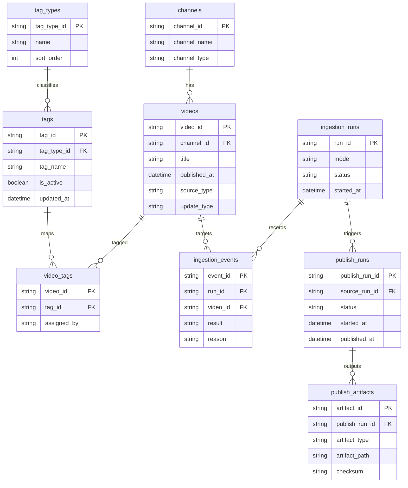

## 設計方針
- ERDはDB正本を中心に、収集実行、タグ管理、公開反映の関係を示す。
- 利用者向け配信成果物はDB派生であり、ERDでは正本データのみを扱う。

## 設計要点
- `videos` を中心に `channels`、`video_tags`、`tags` を関連付ける。
- `ingestion_runs` と `ingestion_events` で収集実行履歴を保持する。
- `publish_runs` と `publish_artifacts` で公開反映履歴を保持する。

## 図

## 変更履歴
- 2026-02-11: DB正本と公開反映履歴を含むER図へ再構成 [[BD-ADR-021]]
- 2026-02-10: 新規作成 [[BD-ADR-001]]
