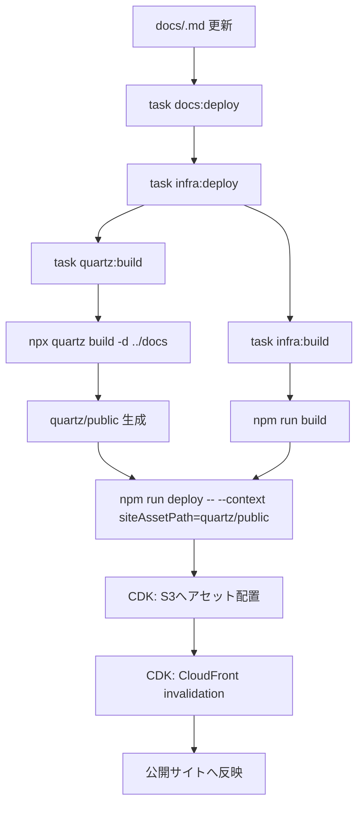

## 目的
- Quartz と infra（AWS CDK）を連携したドキュメント公開フローの実行順序と責務分担を明確化する。

## 前提
- 将来運用では `quartz/` と `infra/` を同一リポジトリ配下に配置し、`task docs:deploy` を公開標準コマンドとして提供する。
- 公開対象は Obsidian文書をQuartzでビルドした静的成果物（`quartz/public`）とする。

## 公開フロー（全体）

## 実行チェーン
- 標準コマンドは `task docs:deploy` を使用する。
- `docs:deploy` は `infra:deploy` を呼び出す。
- `infra:deploy` は依存として `quartz:build` と `infra:build` を実行する。
- `quartz:build` は `npx quartz build -d ../docs` により `quartz/public` を生成する。
- `infra:deploy` は `npm run deploy -- --context siteAssetPath=<repo>/quartz/public` を実行し、配信元アセットを明示する。

## 配信実装（infra）
- `QuartzSiteStack` は `siteAssetPath` context（未指定時は `../../quartz/public`）を参照する。
- `BucketDeployment` で `siteAssetPath` を S3 の `obsidian/` プレフィックスへ配置する。
- CloudFront Distribution は S3 Origin + OAC 構成で、S3 バケットは公開禁止（`BLOCK_ALL`）とする。
- デプロイ時に `distributionPaths: ["/*"]` を指定し、CloudFront のキャッシュを無効化する。

## URL ルーティング
- CloudFront Function（`pretty-url-rewrite.js`）で拡張子なしURLを `.html` へ補完する。
- `/` へのアクセスは `RQ-HM-001.html` へリライトし、公開トップを固定する。
- `/path/` 形式は `index.html` を補完する。

## 失敗時の確認観点
- Quartz build 失敗時: `docs/` の Markdown 記法とリンク不整合を確認し、再度 `task quartz:build` を実行する。
- CDK deploy 失敗時: AWS 認証情報（`CDK_DEFAULT_ACCOUNT`/`CDK_DEFAULT_REGION`）と `siteAssetPath` の解決パスを確認する。
- 反映遅延時: CloudFront invalidation の完了状態を確認し、必要時に再デプロイする。

## 変更履歴
- 2026-02-11: 新規作成
