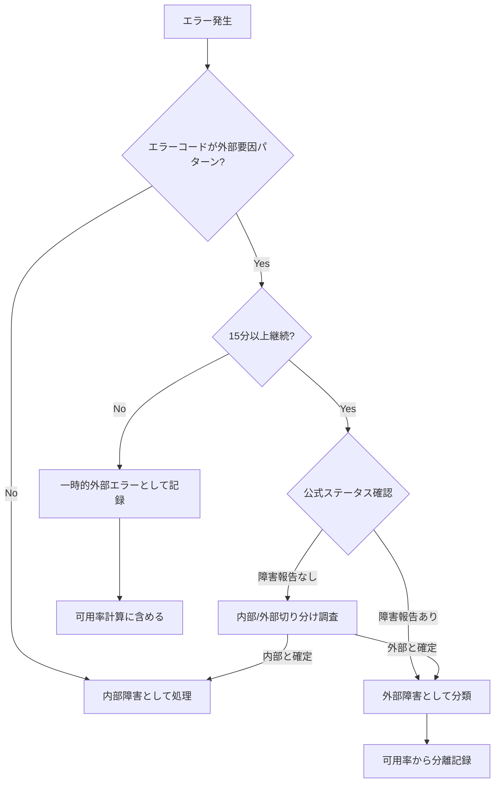

## 目的
- [[RQ-AV-001]] の可用率/MTTR要件を、監視データから再現可能に算出する。
- 障害発生時の一次復旧判定を時刻基準で統一し、運用判断の揺れを防ぐ。

## 可用率算出
| 項目 | 定義 |
| --- | --- |
| 観測対象時間 | 月内総時間 - 計画停止時間（上限120分） |
| 正常時間 | `2xx/3xx` 応答を返した1分バケット合計 |
| 月次可用率 | 正常時間 / 観測対象時間 |
| 合格基準 | 99.5%以上 |

## MTTR算出
| 項目 | 定義 |
| --- | --- |
| 基準SLI | `/web`経路の成功率（2xx/3xx応答割合） |
| 閾値 | 成功率 99%（1分バケット単位） |
| 障害開始時刻 | 基準SLIが閾値を3分連続で下回った最初の時刻 |
| 一次復旧時刻 | 基準SLIが閾値以上に戻り15分連続維持した時刻 |
| MTTR | 一次復旧時刻 - 障害開始時刻 |
| 合格基準 | 運用時間帯内（平日09:00-21:00 JST）は30分以内 |

### MTTR判定の補足
- 基準SLIは `/web`経路（[[RQ-GL-007|bootstrap]].json, [[RQ-GL-008|タグマスター]].json, [[RQ-GL-009|アーカイブ索引]].pN.json）の成功率を単一指標とする。
- 他の経路（`/docs`, `/api/v1`）は参考値として記録するが、MTTR算出には用いない。
- 3分連続判定は単発の一時的エラー（ネットワークジッタ等）を除外するための閾値である。

## 障害分類
| 区分 | 判定条件 | 扱い |
| --- | --- | --- |
| 内部障害 | 収集/配信/設定不備による失敗 | 可用率計算に含める |
| 外部障害 | 外部障害判定アルゴリズム（後述）に合致 | 可用率から分離記録し、備考で明示 |
| 計画停止 | 事前通知済み停止（24時間前までに告知） | 観測対象時間から除外 |

### 外部障害判定アルゴリズム
以下の条件をすべて満たす場合、外部障害と判定する。

1. **エラーコード判定**: 収集runのエラーが以下のいずれかに該当する。
   - YouTube Data API: `403 quotaExceeded`, `503 backendError`, `500 internalError`
   - HTTP接続: `ETIMEDOUT`, `ECONNRESET`, `ENOTFOUND`
   - CloudFront: 5xxステータス（オリジン障害）
2. **継続時間判定**: 同一エラーが15分以上断続的に発生する（5分以内の間隔で再発）。
3. **公式ステータス確認**: 依存先の公式ステータスページ（YouTube API Status, AWS Health Dashboard）で障害が報告されている、または確認できない状態である。

### 外部障害判定フロー

### 外部障害記録項目
| 項目 | 内容 |
|------|------|
| 発生時刻 | 最初のエラー検知時刻 |
| 復旧時刻 | 正常応答が15分連続維持した時刻 |
| 影響時間 | 復旧時刻 - 発生時刻 |
| 依存先 | YouTube Data API / AWS CloudFront / その他 |
| エラーコード | 発生したエラーコード一覧 |
| 公式ステータス | 依存先の公式障害報告URL（存在する場合） |

## 監視アラート
- Critical: 月次可用率が99.5%未達見込み、または連続失敗3回。
- Warning: 単発障害だが15分超過、またはMTTR見込み30分超過。
- Info: 短時間劣化で自己回復。

## 運用フロー
1. 障害検知時に障害区分を確定する。
2. 内部障害は一次復旧（サービス再開）を優先し、復旧後に恒久対処を計画する。
3. 外部障害は依存先状況を記録し、回復後に影響時間を切り分ける。
4. 日次でMTTRと未解決件数を集計し、[[AT-OPS-001]] へ記録する。
5. 月次判定値を [[AT-RPT-001]] に転記し、Go/No-Go判定へ渡す。

## 変更履歴
- 2026-02-13: MTTR判定基準を単一SLI（`/web`経路成功率）に明確化し、3分連続判定条件を追加
- 2026-02-13: 外部障害判定アルゴリズム（エラーコード/継続時間/公式ステータス）と判定フローを追加
- 2026-02-13: 外部障害記録項目を追加し、[[BD-INF-DEP-006]]/[[DD-SYS-COST-001]]との参照を追加
- 2026-02-11: [[BD-SYS-QUAL-001|品質特性]]との追跡性補強のため `BD-SYS-QUAL-001` 参照を追加
- 2026-02-11: 可用率/MTTRの算出式、障害分類、運用フローを追加
- 2026-02-10: 新規作成
