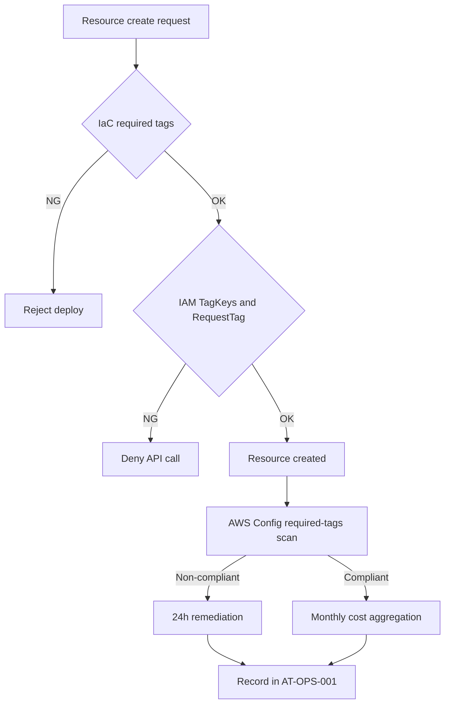

## 詳細仕様
- 本設計は単一アカウントでのAWSタグ統制を対象とし、作成時強制（IaC/IAM）と事後検知（Config）を組み合わせる。
- タグキーの大小文字は区別されるため、`UpperCamelCase` の正規キー以外を許容しない。
- タグ値へのPII/秘密情報格納を禁止し、監査で検知した場合は当日是正する。

## [[RQ-GL-005|タグ辞書]]（正本）
| Key | 必須 | 目的 | 許容値/形式 | 備考 |
|---|---|---|---|---|
| `CostCenter` | 必須 | コスト配賦 | `CC[0-9]{4}` | 請求集計軸 |
| `Environment` | 必須 | 環境区分 | `Production` / `Development` | 列挙固定 |
| `Owner` | 必須 | 問い合わせ先 | チーム識別子（例: `platform-team`） | 個人名を避ける |
| `Project` | 必須 | プロダクト集約 | `diopside` | プロダクト単位 |
| `ManagedBy` | 必須 | 管理方式 | `CDK` / `Manual` | 変更統制 |
| `Description` | 必須 | 一覧上の用途判別 | 10-120文字の説明文 | 曖昧語のみの記載を禁止 |

## 強制レイヤ
- IaC:
  - 標準タグセットを共通変数として定義し、未設定時はデプロイ失敗とする。
  - `Environment` は列挙値バリデーションで制約する。
- IAM:
  - `aws:TagKeys` で許可キーを制限し、表記ゆれキーを拒否する。
  - `aws:RequestTag/Environment` で許容値以外を拒否する。
  - `aws:RequestTag/CostCenter` など必須キー欠落の作成リクエストを拒否する。
  - `aws:RequestTag/Description` の欠落を拒否し、説明未設定リソースの作成を禁止する。

## 検知と是正
- AWS Config `required-tags` で必須タグ欠落を日次検知する。
- 日次監査レポートで「必須タグ付与率」「未タグリソース数」「是正完了時間」を記録する。
- 欠落検知時は24時間以内に補完し、補完完了までは当該リソースの追加変更を凍結する。
- `description/comment` を持つリソースは、欠落をP3ドリフトとして3営業日以内に是正する。

## Billing運用
- `CostCenter` / `Environment` / `Project` をコスト配分タグとして有効化する。
- 反映遅延（タグキー表示最大24時間 + 有効化反映最大24時間）を考慮し、月次集計は月初3営業日以内に確定する。
- 集計結果は [[AT-OPS-001]] へ記録し、[[RQ-COST-001]] の閾値（3,000円/2,700円）と照合する。

## コスト超過検知アルゴリズム

### 検知閾値
| 閾値種別 | 値 | アクション |
|---------|-----|-----------|
| 月額上限 | 3,000円 | 超過確定時: 新規リソース追加停止 |
| 予兆閾値 | 2,700円（上限の90%） | 月中予測超過時: 48時間以内に抑制施策適用 |
| 日次異常閾値 | 100円/日（月額上限の1/30） | 超過継続時: 原因調査実施 |

### 予測コスト算出方法
```
月末予測コスト = (経過日数までの累積コスト / 経過日数) × 当月総日数
```

### 検知タイミング
| 確認タイミング | 確認内容 | アラート条件 |
|---------------|---------|-------------|
| 日次（09:00 JST） | 前日コスト増分 | 日次異常閾値超過 |
| 週次（月曜09:00 JST） | 週次累積コスト | 週平均が月額上限の1/4を超過 |
| 月中（15日09:00 JST） | 月末予測コスト | 予兆閾値（2,700円）超過 |

### 抑制施策優先順位
予兆閾値超過時は、以下の優先順位で抑制施策を検討・適用する。
| 優先度 | 施策 | 影響範囲 | 想定削減効果 |
|-------|------|---------|------------|
| 1 | CloudFrontキャッシュTTL延長（60秒→300秒） | 閲覧体験に軽微な影響 | 約10-20% |
| 2 | 収集頻度低減（毎時→3時間ごと） | 新着反映遅延 | 約15-25% |
| 3 | ログ保持期間短縮（30日→14日） | 監査期間短縮 | 約5-10% |
| 4 | 開発環境停止 | 開発効率低下 | 約20-30% |

### コスト異常アラート
| レベル | 条件 | 通知先 | 対応期限 |
|-------|------|-------|---------|
| Critical | 月額上限超過確定 | [[RQ-SH-001]] | 即時対応 |
| Warning | 予兆閾値超過 | [[RQ-SH-001]] | 48時間以内 |
| Info | 日次異常閾値超過（単発） | ログ記録のみ | 翌日確認 |

## フロー


## I/Oまたは責務
- 入力:
  - IaCタグ定義（必須キー、許容値）
  - 作成リクエストのタグ情報
  - AWS Config準拠結果、請求タグ集計結果
- 出力:
  - 作成可否判定（許可/拒否）
  - タグ準拠レポート（日次）
  - 月次コスト配賦レポートと是正記録（[[AT-OPS-001]]）

## 変更履歴
- 2026-02-21: `Description` を必須タグへ追加し、説明フィールド欠落の検知・是正条件を追加
- 2026-02-14: `Environment` 許容値を `Production` / `Development` へ更新し、抑制施策の環境表記を2環境運用へ整合
- 2026-02-13: `ManagedBy` の許容値をCDKオンリー方針へ更新（`CDK`/`Manual`）
- 2026-02-13: コスト超過検知アルゴリズム（検知閾値/予測算出/抑制施策優先順位/アラートレベル）を追加
- 2026-02-13: [[DD-SYS-AV-001]]/[[BD-INF-MON-001]]との相互参照を追加
- 2026-02-11: 単一アカウント向けタグ統制（IaC/IAM/Config/Billing運用）を追加
- 2026-02-10: 新規作成
