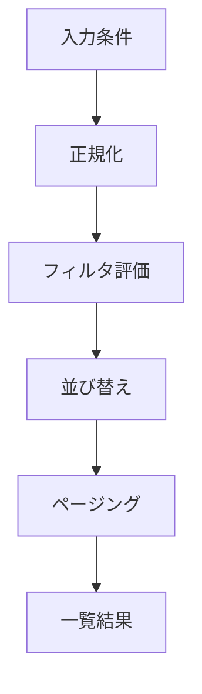

## 詳細仕様
- 検索は「前処理 -> フィルタ評価 -> 並び替え -> ページング」の4段階で実行する。
- 一覧操作の応答速度を維持するため、前処理結果をメモリキャッシュして再利用する。
- 条件入力は [[DD-APP-UI-012|SearchConditionPanel]]、一覧反映は [[DD-APP-UI-013|ArchiveList]] を起点に適用する。

## 処理手順
1. 前処理: キーワード正規化（小文字化、全半角吸収、連続空白圧縮）。
2. フィルタ評価: タグ、期間、キーワード、種別のAND条件で候補抽出。
3. 並び替え: `published_at desc` を既定とし、要求に応じて `asc` / `title` を選択。
4. ページング: `pageSize` 単位で切り出し、`hasNext` を返却。

## スコアリング
- キーワード一致は `title` を優先し、`description` 一致より高スコアとする。
- タグ一致件数を補正点として加算し、同点時は公開日時の新しい順を採用する。
- 完全一致が0件の場合は部分一致へフォールバックする。

## 境界条件
- 空条件では全件一覧を返す。
- 絞り込み結果0件時は空配列と `hasNext=false` を返す。
- 不正ページ番号は `0` とみなす。

## [[RQ-GL-016|コメント密度波形]]区間抽出アルゴリズム
- 目的: [[RQ-GL-015|盛り上がり区間]]を動画詳細の見どころ導線として抽出する。
- 入力: 動画単位コメント時系列（秒単位の件数列）。
- 出力: `startSec`, `endSec`, `density`, `commentCount` の区間配列。

### 処理手順
1. 動画全体を固定幅（30秒）のウィンドウへ分割する。
2. 各ウィンドウのコメント件数を集計する。
3. 全ウィンドウの平均（mu）と標準偏差（sigma）を算出する。
4. `count > mu + 1.5 * sigma` を満たすウィンドウを高密度と判定する。
5. 連続する高密度ウィンドウを1区間に統合する。
6. 統合後の区間長が10秒未満の区間は除外する。
7. 密度指標降順で整列し、上位5区間を採用する。

### パラメータ
| パラメータ | 設定値 | 補足 |
| --- | --- | --- |
| ウィンドウ幅 | 30秒 | 小さいほど細粒度検出 |
| 閾値係数 | 1.5 | 大きいほど厳選 |
| 最小区間長 | 10秒 | ノイズ短区間を除外 |
| 最大区間数 | 5件 | UI表示上限と整合 |

## I/Oまたは責務
- 入力: `archive_index` データ、[[RQ-GL-005|タグ辞書]]、[[RQ-GL-014|検索条件]]、並び順指定、ページ情報。
- 出力: 絞り込み済み一覧、件数、ページング情報、空結果判定。

## 図

## 変更履歴
- 2026-02-19: [[RQ-GL-015|盛り上がり区間]]抽出アルゴリズム（窓幅/閾値/上限）を本書へ移管
- 2026-02-14: `SearchConditionPanel` / `ArchiveList` への責務リンクを追加
- 2026-02-11: 検索処理手順、スコアリング、境界条件を具体化
- 2026-02-10: 新規作成
