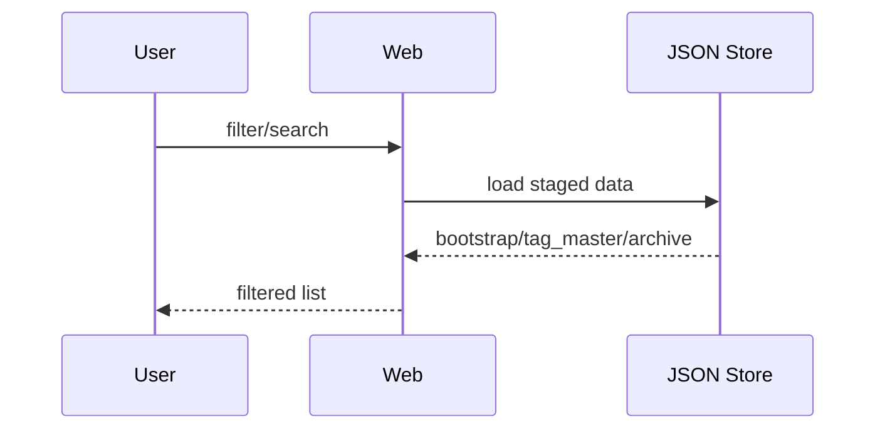

## 詳細仕様
- tag_typesテーブルの詳細仕様を定義する。
- 実装は`web/`の現行コードと整合させる。

## I/Oまたは責務
- 入力: 収集データ・検索条件・運用操作。
- 出力: 一覧結果・詳細表示・運用ログ。

## 図

```mermaid
sequenceDiagram
  participant U as User
  participant W as Web
  participant J as JSON Store
  U->>W: filter/search
  W->>J: load staged data
  J-->>W: bootstrap/tag_master/archive
  W-->>U: filtered list
```

## 変更履歴
- 2026-02-10: 新規作成
