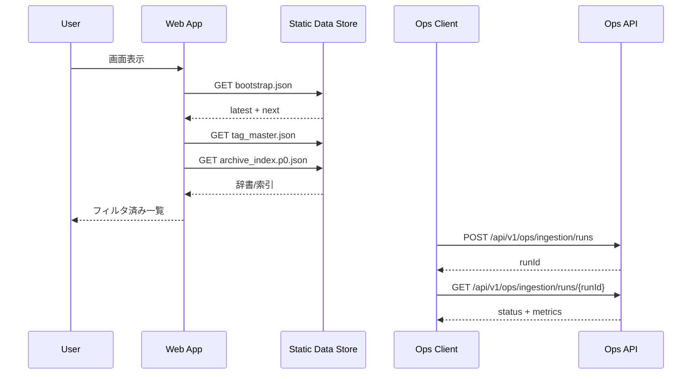

## 詳細仕様
- 本システムのAPI境界は「配信用データ契約」と「運用用制御API」で構成する。
- MVPの利用者向け機能は静的JSON契約を主APIとして扱い、Webはこの契約に依存して動作する。
- 運用用制御APIは `/api/v1/ops/*` を正本経路とし、一般利用者UIとは分離する。
- 更新系データの正本はDBとし、配信契約は生成済み成果物を参照する。
- 将来の高度検索は `API検索エンドポイント` を追加予定とし、本書では予約境界のみ定義する。

## MVP対象API一覧
| 区分 | API/契約 | 詳細設計 |
|---|---|---|
| 配信契約 | `bootstrap.json` / `archive_index.p{page}.json` | [[DD-API-004]] |
| 配信契約 | `tag_master.json` / `highlights/{videoId}.json` / `wordcloud/{videoId}.png` | [[DD-API-005]] |
| 運用API | `POST /api/v1/ops/ingestion/runs` | [[DD-API-002]] |
| 運用API | `GET /api/v1/ops/ingestion/runs/{runId}` | [[DD-API-003]] |
| 運用API | `GET /api/v1/ops/ingestion/runs/{runId}/items` | [[DD-API-011]] |
| 運用API | `POST /api/v1/ops/ingestion/runs/{runId}/retry` | [[DD-API-008]] |
| 運用API | `GET /api/v1/ops/ingestion/latest` / `GET /api/v1/ops/diagnostics/health` | [[DD-API-009]] |
| 運用API | `POST /api/v1/ops/rechecks` / `GET /api/v1/ops/rechecks/{recheckRunId}` | [[DD-API-012]] |
| 運用API | `POST /api/v1/admin/tags` / `PATCH /api/v1/admin/tags/{tagId}` / `PATCH /api/v1/admin/videos/{videoId}/tags` | [[DD-API-013]] |
| 運用API | `POST /api/v1/admin/publish/tag-master` / `GET /api/v1/admin/publish/{publishRunId}` | [[DD-API-015]] |
| 運用API | `POST /api/v1/admin/docs/publish` / `GET /api/v1/admin/docs/publish/{docsPublishRunId}` | [[DD-API-014]] |

## 契約分類
- Public Read Contract（配信契約）
  - `bootstrap.json`: 初回描画に必要な最新動画セットと次リソース参照。
  - `tag_master.json`: 全[[RQ-GL-005|タグ辞書]]と[[RQ-GL-013|タグ種別]]定義。
  - `archive_index.p{page}.json`: 全件閲覧用の[[RQ-GL-009|archive_index（ページング済み索引）]]。
- Ops Control Contract（運用契約）
  - [[RQ-GL-002|収集ジョブ]]開始、実行状態確認、失敗ジョブ再実行、直近結果照会。
  - 実行履歴は運用監査対象として保持する。

## Public Read Contract 詳細
- `bootstrap.json`
  - 必須項目: `schemaVersion`, `generatedAt`, `tagTypes`, `tagPreview`, `latest`, `next`。
  - `next` で `tag_master` と `archive_index` の取得先を指示する。
- `tag_master.json`
  - 必須項目: `schemaVersion`, `tagMasterVersion`, `tagTypes`, `tags`。
  - `tags` はタグID解決の正本として扱う。
- `archive_index.p{page}.json`
  - 必須項目: `page`, `pageSize`, `total`, `items`。
  - `items` は動画一覧表示とフィルタの入力データ。

## Ops Control Contract 詳細
- `POST /api/v1/ops/ingestion/runs`
  - 用途: [[RQ-GL-002|収集ジョブ]]開始。
  - 応答: `runId`, `acceptedAt`, `mode`（scheduled/manual）。
- `GET /api/v1/ops/ingestion/runs/{runId}`
  - 用途: 実行状態確認。
  - 応答: `status`（queued/running/succeeded/failed）, `processedCount`, `errorSummary`。
- `POST /api/v1/ops/ingestion/runs/{runId}/retry`
  - 用途: 失敗ジョブの再実行。
  - 応答: 新しい`runId`と関連元`runId`。
- `GET /api/v1/ops/ingestion/latest`
  - 用途: 最新収集結果の確認。
  - 応答: `lastSuccessAt`, `targetCounts`, `warnings`。

## 処理ロジック共通規約
- 認証: `/api/v1/*` はJWT必須。未認証は401で即時終了し、副作用を発生させない。
- 入力検証: 構文検証 -> 業務検証 -> 競合検証の順に評価し、最初の失敗理由を返す。
- 状態遷移: run系は `queued -> running -> succeeded|failed|partial|cancelled` を共通に採用する。
- 冪等制御: 更新系POSTは `Idempotency-Key` を受理し、重複実行時は既存runを返す。
- 失敗時保全: 公開系処理失敗時は直前公開版を維持し、ロールバック可否を応答へ含める。
- 監査記録: 管理操作は `operator`, `request_id`, `trace_id`, `target_id` を監査ログへ記録する。

## 将来予約境界（MVP非対象）
- [[DD-API-006]] 検索API（サーバ検索）は予約のみ。MVPではクライアント検索を維持する。
- [[DD-API-007]] 動画詳細API（サーバ詳細取得）は予約のみ。MVPでは静的配信から組み立てる。

## 共通エラーモデル
- HTTP APIエラーは Problem Details（`application/problem+json`）を標準とする。
- 必須メンバー: `type`, `title`, `status`, `detail`, `instance`。
- 拡張メンバー: `code`, `category`, `retryable`, `trace_id`, `occurred_at`, `errors[]`, `hint`。
- `detail` の文字列パースを前提にせず、機械判定は `code` と `errors[]` で行う。
- `trace_id` は `DD-LOG-001` のログ相関キーと同一値を使用する。

## バージョニング方針
- 配信契約は `schemaVersion` で互換性管理する。
- 破壊的変更はメジャー更新し、旧版の併存期間を設ける。
- 運用契約は `/api/v1/ops` 配下でURL互換性を維持し、追加中心で拡張する。
- 将来の検索APIは `/api/v2/search/*` を候補とし、確定までは互換要件のみ維持する。

## 図

## 受入条件
- Webが `bootstrap -> tag_master -> archive_index` の順に取得し、段階表示できる。
- 異常時に Problem Details で通知し、`trace_id` で追跡できる。
- 運用APIで収集開始から結果確認まで完結できる。

## 変更履歴
- 2026-02-11: Problem Details 正本化と `trace_id` への統一、`BD-API-003/005` と `BD-ARCH-002/003/004` 参照を追加
- 2026-02-11: MVP対象API一覧、共通処理ロジック規約、`/api/v1` 正本経路を追加 [[BD-ADR-021]]
- 2026-02-11: DB正本前提と将来検索API予約境界を追記 [[BD-ADR-021]]
- 2026-02-11: `archive_index.p{page}.json` の用語表現を [[RQ-GL-009]] へ統一
- 2026-02-10: 新規作成
- 2026-02-10: 配信契約/運用契約、エラーモデル、バージョニング方針を追加
