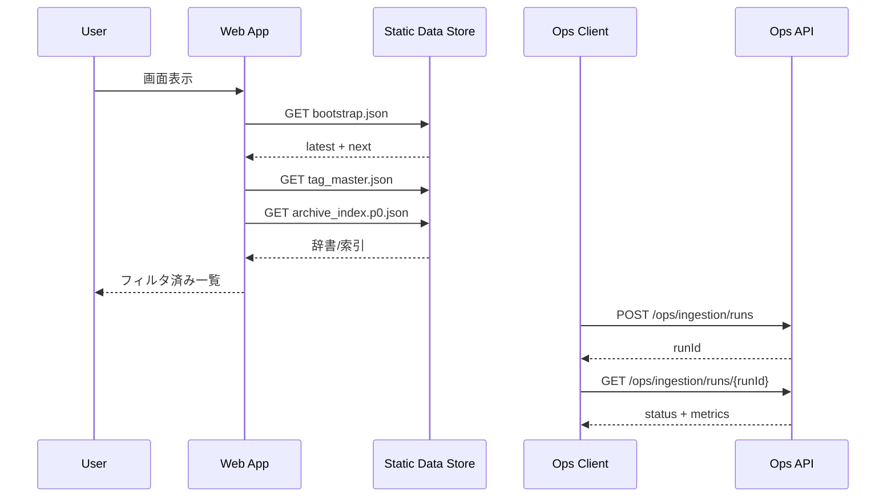

## 詳細仕様
- 本システムのAPI境界は「配信用データ契約」と「運用用制御API」で構成する。
- MVPの利用者向け機能は静的JSON契約を主APIとして扱い、Webはこの契約に依存して動作する。
- 運用用制御APIは収集実行・[[RQ-GL-011|再収集]]・状態確認を対象にし、一般利用者UIとは分離する。

## 契約分類
- Public Read Contract（配信契約）
  - `bootstrap.json`: 初回描画に必要な最新動画セットと次リソース参照。
  - `tag_master.json`: 全[[RQ-GL-005|タグ辞書]]とタグ種別定義。
  - `archive_index.p{page}.json`: 全件閲覧用のページング索引。
- Ops Control Contract（運用契約）
  - [[RQ-GL-002|収集ジョブ]]開始、実行状態確認、失敗ジョブ再実行、直近結果照会。
  - 実行履歴は運用監査対象として保持する。

## Public Read Contract 詳細
- `bootstrap.json`
  - 必須項目: `schemaVersion`, `generatedAt`, `tagTypes`, `tagPreview`, `latest`, `next`。
  - `next` で `tag_master` と `archive_index` の取得先を指示する。
- `tag_master.json`
  - 必須項目: `schemaVersion`, `tagMasterVersion`, `tagTypes`, `tags`。
  - `tags` はタグID解決の正本として扱う。
- `archive_index.p{page}.json`
  - 必須項目: `page`, `pageSize`, `total`, `items`。
  - `items` は動画一覧表示とフィルタの入力データ。

## Ops Control Contract 詳細
- `POST /ops/ingestion/runs`
  - 用途: [[RQ-GL-002|収集ジョブ]]開始。
  - 応答: `runId`, `acceptedAt`, `mode`（scheduled/manual）。
- `GET /ops/ingestion/runs/{runId}`
  - 用途: 実行状態確認。
  - 応答: `status`（queued/running/succeeded/failed）, `processedCount`, `errorSummary`。
- `POST /ops/ingestion/runs/{runId}/retry`
  - 用途: 失敗ジョブの再実行。
  - 応答: 新しい`runId`と関連元`runId`。
- `GET /ops/ingestion/latest`
  - 用途: 最新収集結果の確認。
  - 応答: `lastSuccessAt`, `targetCounts`, `warnings`。

## 共通エラーモデル
- `code`: 一意エラーコード（例: `INGESTION_TIMEOUT`, `INVALID_CURSOR`）。
- `message`: 利用者向け短文メッセージ。
- `details`: デバッグ補足（運用画面のみ表示）。
- `traceId`: 監視・ログ相関用ID。

## バージョニング方針
- 配信契約は `schemaVersion` で互換性管理する。
- 破壊的変更はメジャー更新し、旧版の併存期間を設ける。
- 運用契約は `/ops` 配下でURL互換性を維持し、追加中心で拡張する。

## 図

## 受入条件
- Webが `bootstrap -> tag_master -> archive_index` の順に取得し、段階表示できる。
- 異常時に共通エラーモデルで通知し、`traceId` で追跡できる。
- 運用APIで収集開始から結果確認まで完結できる。

## 変更履歴
- 2026-02-10: 新規作成
- 2026-02-10: 配信契約/運用契約、エラーモデル、バージョニング方針を追加
