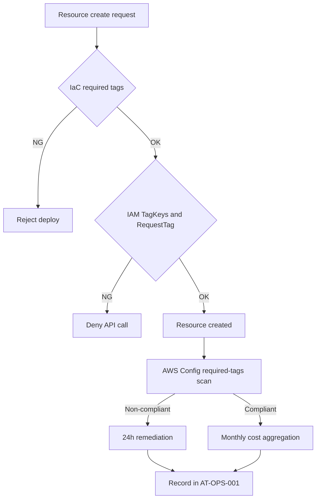

## 詳細仕様
- 本設計は単一アカウントでのAWSタグ統制を対象とし、作成時強制（IaC/IAM）と事後検知（Config）を組み合わせる。
- タグキーの大小文字は区別されるため、`UpperCamelCase` の正規キー以外を許容しない。
- タグ値へのPII/秘密情報格納を禁止し、監査で検知した場合は当日是正する。

## [[RQ-GL-005|タグ辞書]]（正本）
| Key | 必須 | 目的 | 許容値/形式 | 備考 |
|---|---|---|---|---|
| `CostCenter` | 必須 | コスト配賦 | `CC[0-9]{4}` | 請求集計軸 |
| `Environment` | 必須 | 環境区分 | `Production` / `Staging` / `Development` / `Test` | 列挙固定 |
| `Owner` | 必須 | 問い合わせ先 | チーム識別子（例: `platform-team`） | 個人名を避ける |
| `Project` | 必須 | プロダクト集約 | `diopside` | プロダクト単位 |
| `ManagedBy` | 必須 | 管理方式 | `Terraform` / `CDK` / `Manual` | 変更統制 |

## 強制レイヤ
- IaC:
  - 標準タグセットを共通変数として定義し、未設定時はデプロイ失敗とする。
  - `Environment` は列挙値バリデーションで制約する。
- IAM:
  - `aws:TagKeys` で許可キーを制限し、表記ゆれキーを拒否する。
  - `aws:RequestTag/Environment` で許容値以外を拒否する。
  - `aws:RequestTag/CostCenter` など必須キー欠落の作成リクエストを拒否する。

## 検知と是正
- AWS Config `required-tags` で必須タグ欠落を日次検知する。
- 日次監査レポートで「必須タグ付与率」「未タグリソース数」「是正完了時間」を記録する。
- 欠落検知時は24時間以内に補完し、補完完了までは当該リソースの追加変更を凍結する。

## Billing運用
- `CostCenter` / `Environment` / `Project` をコスト配分タグとして有効化する。
- 反映遅延（タグキー表示最大24時間 + 有効化反映最大24時間）を考慮し、月次集計は月初3営業日以内に確定する。
- 集計結果は `[[AT-OPS-001]]` へ記録し、`[[RQ-COST-001]]` の閾値（3,000円/2,700円）と照合する。

## フロー

## I/Oまたは責務
- 入力:
  - IaCタグ定義（必須キー、許容値）
  - 作成リクエストのタグ情報
  - AWS Config準拠結果、請求タグ集計結果
- 出力:
  - 作成可否判定（許可/拒否）
  - タグ準拠レポート（日次）
  - 月次コスト配賦レポートと是正記録（`[[AT-OPS-001]]`）

## 変更履歴
- 2026-02-11: 単一アカウント向けタグ統制（IaC/IAM/Config/Billing運用）を追加
- 2026-02-10: 新規作成
