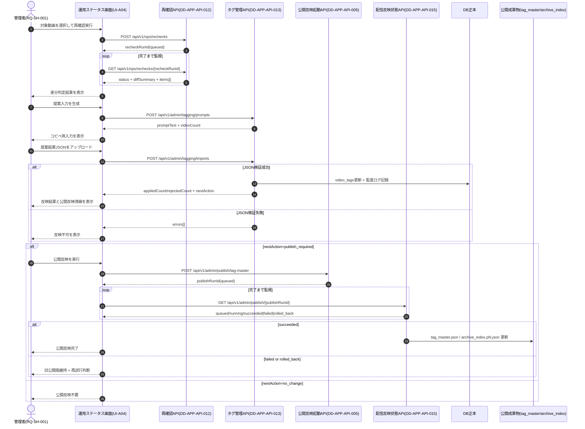

## シナリオ目的
- 配信前後再確認、手動タグ付け、公開反映までの運用フローが受入手順として実行可能であることを確認する。

## 対応DD-API
- [[DD-APP-API-005]]（[[RQ-GL-005|タグ辞書]]API/公開反映起動）
- [[DD-APP-API-012]]（[[DD-APP-API-012|配信前後再確認API]]）
- [[DD-APP-API-013]]（[[DD-APP-API-013|タグ管理API]]）
- [[DD-APP-API-015]]（[[DD-APP-API-015|配信反映ジョブ状態API]]）

## 前提条件
- [[RQ-SH-001|管理者]]が管理画面（UI-A04）にアクセスできる。
- 対象動画に配信前メタデータ記録が存在し、配信後再確認を実行できる。
- 手動タグ付けに利用する提案JSONの入力元（外部LLM）が利用可能である。

## 手順
1. 管理画面から `POST /api/v1/ops/rechecks` を実行し、配信後再確認 run を起動する。
2. `GET /api/v1/ops/rechecks/{recheckRunId}` をポーリングし、`diffSummary` と `items[]` の状態を確認する。
3. 管理画面で `POST /api/v1/admin/tagging/prompts` を実行し、提案入力テキストを取得して外部LLMへ入力する。
4. 外部LLMの結果JSONを管理画面へアップロードし、`POST /api/v1/admin/tagging/imports` の検証結果を確認する。
5. 検証成功時のみ反映を確定し、`appliedCount/rejectedCount/errors[]` を記録する。
6. `nextAction=publish_required` の場合は公開反映を実行し、`GET /api/v1/admin/publish/{publishRunId}` で完了まで監視する。
7. `succeeded` 時は `tag_master.json` と `archive_index.pN.json` の更新を確認し、`failed/rolled_back` 時は旧公開版維持と再試行判断を記録する。

## シーケンス図

## 期待結果
- 配信後再確認の差分あり/差分なし/失敗/対象外が区別して記録される。
- 配信結果タグ付けは自動実行されず、[[RQ-SH-001|管理者]]の確定操作時のみ反映される。
- JSON検証失敗時は反映が拒否され、エラー明細を再入力に利用できる。
- 反映後の公開反映で `tag_master.json` と `archive_index.pN.json` の更新可否が追跡できる。

## 判定基準対応
- 機能判定: [[RQ-FR-019]]（配信前後再確認と手動タグ運用）がPass。
- 運用判定: 公開反映失敗時に旧公開版維持と再試行判断が記録できる。
- データ判定: JSON検証失敗レコードがDBへ誤反映されない。

## 記録項目
- `recheckRunId` / `publishRunId`
- `diffSummary.changedCount/unchangedCount/failedCount`
- `validatedCount/appliedCount/rejectedCount`
- `nextAction` と公開反映の最終状態
- エラーコードとエラー明細
- 対応DD-API（[[DD-APP-API-005]], [[DD-APP-API-012]], [[DD-APP-API-013]], [[DD-APP-API-015]]）
- 判定（Pass/Fail）

## 変更履歴
- 2026-02-11: 新規作成
